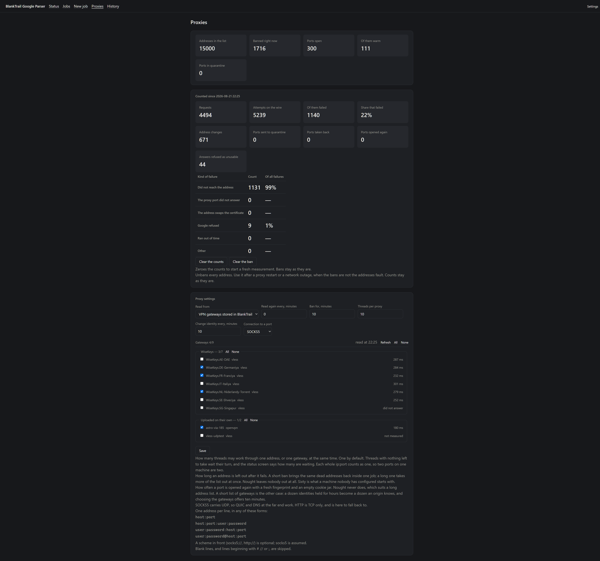

# Google SERP Parser

Free and open-source **Google search results parser and rank tracker**, written
in Go. Scrapes Google SERPs through your own proxies or through **VPN gateways**,
checks whether a page is **indexed**, and tracks where a site ranks. Browser
interface, CSV/JSON exports, and a SerpApi-compatible HTTP API. Powered by
[BlankTrail Proxy](https://blanktrail.com).

**Русская версия: [README.ru.md](README.ru.md)**

> ⚠️ **This program only works through [BlankTrail Proxy](https://blanktrail.com) with [Challenge Breaker](https://blanktrail.com/#features)** — a hard
> requirement, not a recommendation. **The solver passes reCAPTCHA:** 721 of 821
> challenges solved on a live run, 88 per cent, and the identity carries on
> working afterwards. Everything else is set up in this program, not in that one.


---

## 🚀 Quick start

This is the whole road from nothing to a finished job. Everything below it is
reference; this part is what you do.

Two programs are involved and **only one of them is configured**.
[BlankTrail Proxy](https://blanktrail.com) carries the sessions through Google's
challenge; this parser drives it. Nothing is set up on the BlankTrail side — no
proxy list, no ports, no profiles, no gateways chosen there. It has to be
running, and it has to hand over one key. The address list, the identities, the
threads, the jobs and the exports all live in this program's own screens.

No Go, no build, no dependencies. One file to download and one to double-click.

### 1. Start BlankTrail Proxy and copy its key

Install [BlankTrail Proxy](https://blanktrail.com) with a licence that includes
[Challenge Breaker](https://blanktrail.com/#features), and start it. Then take
two things from it:

- **the control API address** — `http://127.0.0.1:8891` unless you have moved
  it;
- **the API key** — *Settings → API key* in BlankTrail. Issue one if there is
  none yet.

That is all it is asked for. You do **not** create ports there, you do **not**
paste your proxy list there, and you do **not** tick VPN configurations there:
the parser opens and closes ports through the control API itself, points each
one at the address or gateway it chose, and closes them again when the job ends.
Its CA certificate is fetched by the parser without anybody having to export it.

Leave BlankTrail running while you work. If it is stopped, the parser says so in
as many words rather than failing quietly.

> Why it cannot be done without it: Google serves no parsable results to a plain
> HTTP client at all. This was measured, not assumed: seven client variants,
> direct and proxied, all came back with a 91 KB JavaScript shell holding no
> results. Results appear only after the solver has carried the session through
> the challenge.

### 2. Download the build for your system

Every link here always points at the newest release.

**Windows — one file, nothing to unpack:**

| System | Download |
|---|---|
| Windows, ordinary PC | **[gserp.exe](https://github.com/BlankTrail/google-serp-parser/releases/latest/download/gserp.exe)** |
| Windows on ARM | **[gserp-arm64.exe](https://github.com/BlankTrail/google-serp-parser/releases/latest/download/gserp-arm64.exe)** |

Put it anywhere and double-click it. Everything the program needs is inside
that file — the pages, the icon, the lot — and it writes its history into a
`gserp.db` beside itself. Put it in a folder of its own: that database, and the
settings file next to it, are the program's whole state.

**Linux and macOS:**

| System | Download |
|---|---|
| Linux, ordinary PC or server | [gserp-linux-amd64.tar.gz](https://github.com/BlankTrail/google-serp-parser/releases/latest/download/gserp-linux-amd64.tar.gz) |
| Linux on ARM | [gserp-linux-arm64.tar.gz](https://github.com/BlankTrail/google-serp-parser/releases/latest/download/gserp-linux-arm64.tar.gz) |
| Mac with Apple silicon (M1 and later) | [gserp-macos-apple-silicon.tar.gz](https://github.com/BlankTrail/google-serp-parser/releases/latest/download/gserp-macos-apple-silicon.tar.gz) |
| Mac with an Intel processor | [gserp-macos-intel.tar.gz](https://github.com/BlankTrail/google-serp-parser/releases/latest/download/gserp-macos-intel.tar.gz) |

Each archive holds the program, a starter script, both READMEs and the licence.
Windows zips are there as well — [amd64](https://github.com/BlankTrail/google-serp-parser/releases/latest/download/gserp-windows-amd64.zip),
[arm64](https://github.com/BlankTrail/google-serp-parser/releases/latest/download/gserp-windows-arm64.zip) — for whoever wants the READMEs
beside the program.

Which version a download is, is on the
[release page](https://github.com/BlankTrail/google-serp-parser/releases/latest)
and in `gserp version`.

### 3. Start it

- **Windows** — double-click `gserp.exe`. The console goes away, an icon
  appears in the notification area, and your browser opens at
  `http://127.0.0.1:8080`. The icon is how you close it again.
- **Linux and macOS** — `./start.sh` in a terminal, or `./gserp serve`, then
  open `http://127.0.0.1:8080` yourself.

It listens on this machine only. Reaching it from another one is a setting, and
it is off until you turn it on — see
[Running it on a server](#-running-it-on-a-server).

On a machine nothing has been run on yet it **walks you through the interface**:
seven stops, each a note beside the thing it is talking about — the screens, the
key, the exits, where a job is started, what a job asks for, and where to see
that the machine can reach anything at all. One sentence a stop.

It does not move the program for you. A stop on another screen outlines the
press that leads there and waits; you press it, and the note follows you across
and settles beside the next thing. Close it with the cross at any point; it is in
the header afterwards for whenever it is wanted.

### Windows says it protected your PC

It will, and the builds here cannot stop it. SmartScreen judges a program by the
reputation of whoever signed it, and these are unsigned: there is no certificate
to have a reputation. Press *More info* → *Run anyway*.

What you can do instead of taking that on trust is check that the file you have
is the file that was published. Every release carries a `SHA256SUMS.txt`, and
the sum of your copy should be in it:

```
Get-FileHash .\gserp.exe -Algorithm SHA256
```

Windows also marks anything downloaded, which is what raises the prompt. The
mark can be cleared once, per file:

```
Unblock-File .\gserp.exe
```

> macOS keeps downloaded programs quarantined in the same way. If it refuses to
> open the file, clear the mark once with `xattr -d com.apple.quarantine gserp`
> in the unpacked folder. On Linux and macOS the sums are checked with
> `sha256sum -c SHA256SUMS.txt` or `shasum -a 256 -c SHA256SUMS.txt`.

### 4. Settings: point it at BlankTrail

Open **Settings** — the link at the right-hand end of the strip of tabs. Fill in
the two things from step 1:

- **Control API address** — `http://127.0.0.1:8891`;
- **API key** — paste it. It is kept on this machine and never shown again;
  afterwards the screen shows only its last characters, so you can tell one key
  from another without the key being readable over a shoulder.

Then press **Check the connection**. It says what it found rather than only
whether it worked, and each answer is a different thing to go and do:

| What it says | What it means |
|---|---|
| *BlankTrail is not answering* | The service is not running, or not on that address |
| *BlankTrail rejected the API key* | The key is wrong or has been reissued. Copy it again from *Settings → API key* |
| *The BlankTrail licence is not activated* | The licence really is the problem — activate it in the dashboard |
| *Challenge Breaker is not included in this tariff* | The plan has no solver, and without one Google answers with a challenge page instead of data |
| *Challenge Breaker is entitled but switched off* | The plan includes it, but no solver processes are configured |
| *More ports than Challenge Breaker processes* | The run will work and will be slower: challenges queue |
| Nothing to report | The connection works |

The rest of this screen can be left alone on a first run:

| Setting | What it is |
|---|---|
| Identities kept warm | Ports held open between jobs, so the next job does not start cold. Nought keeps none |
| Result page | Which kind those warm identities are opened for: desktop or mobile |
| Reaching this from another machine | Off by default. Turning it on asks for a password |
| Interface language | English or Russian. Chosen here and nowhere else |

### 5. Proxies: say where the exits come from

Open **Proxies**. At the top are the **profiles**: a profile is a named set of
exits — where the addresses come from and how the ports on them are used — and a
job names one when it is set up. One profile is marked default: it is what a job
that named none runs on, what the identities kept warm are raised on, and what
the HTTP API's own search goes through.

A machine being upgraded finds one profile already there, called `Default`,
holding the settings it was set up with. Nothing about a run changes until you
make a second one.

Under the list is the form that edits the profile you have open, and under that
the live state of the pool while a job runs. **Read from** chooses the source,
and there are three:

- **A file on this machine** — one address a line. All of these are read:

  ```
  host:port
  host:port:user:password
  user:password:host:port
  user:password@host:port
  ```

  A scheme in front (`socks5://`, `http://`) is optional and `socks5` is
  assumed. Blank lines, and lines starting with `#`, `//` or `;`, are skipped —
  so a list can carry comments.

- **An address** — the same list fetched from your provider over HTTP and
  re-read on the interval you set, which is how a rotating list stays current
  without anybody pasting it again.

- **VPN gateways stored in BlankTrail** — the configurations your subscription
  already carries. They appear grouped by subscription with the round trip last
  measured to each, and you tick one, a whole subscription, or all of them at
  once. This is where gateways are chosen; nothing is chosen on the BlankTrail
  side. *Refresh* asks the service for the list again and re-measures.

The rest of the form is how that profile's pool behaves — each of these belongs
to the profile, so two lists can be banned for different lengths and reached over
different protocols:

| Setting | What it does | Start with |
|---|---|---|
| Re-read every, minutes | How often a list at a URL is read again | 30 |
| Ban for, minutes | How long an address that failed is left out. Nought leaves nobody out | 60 |
| Threads per proxy | How many threads may share one address or one gateway at a time | 1 for a long list, more for a short one |
| Change identity every, minutes | How often a port is opened again with a fresh fingerprint and an empty cookie jar | 60; nought never, and gateways offer 10 |
| Connection to a port | SOCKS5 carries UDP, so QUIC and far-side DNS work. HTTP is the fallback | SOCKS5 |

While a job runs, the top of the screen reads the pool: addresses in the list,
banned right now, ports open, of them warm, and in quarantine — then requests,
attempts on the wire, the share that failed, and failures broken down by kind,
so an address that never answered is told apart from Google refusing. *Clear the
counts* starts a fresh measurement; *Clear the ban* puts every address back into
rotation after a restart or an outage that was not their fault.

### 6. New job: the first run

Open **New job**. The form is one screen and it says what the run will cost
before you start it.

| Field | What to put in it |
|---|---|
| Name | Anything you will recognise in the history |
| Kind of job | **Parsing** — collect the results. **Position check** — where one site stands for each phrase. **Index check** — whether Google holds an address at all |
| Site to look for | Only for a position check: the domain whose place you want |
| Where the phrases come from | Paste them, one per line, or upload a `.txt` |
| What to keep of each result | Organic results, ads, related queries — each can be kept or left |
| Country, language | Two-letter codes, e.g. `de`, `en` |
| Pages per query | Depth of pagination. One page is the first ten results |
| Result page | Desktop or mobile |
| Dropping duplicates | Keep everything, one row per URL, or one per host |
| Threads | How many phrases are taken at once |
| Ports per thread | Identities opened per thread. Threads × ports is the size of the pool. Three by default, which measured fastest |
| Use the whole proxy list | A port of its own for every address the list can spare, opened as the run asks for identities, until the list or the service runs out. Ports per thread means nothing while it is ticked |
| Tries per phrase | How many identities one phrase may be carried to before it is called failed |
| Pause on one identity, seconds | The gap before an identity is asked again. Five by default — an identity asked every two seconds answered a dozen requests before it was challenged, one asked every five around forty. Nought means nought |

The line under the form says what pool the job will run on and what it will
cost. Read it once before pressing anything: threads × ports is how many
identities BlankTrail will be asked to open, and that number wants to fit both
your address list and your Challenge Breaker process count.


**Press Start.**

### 7. While it runs, and when it is done

The **Status** screen follows the job: queries done and left, the current URL,
queries and pages a minute, the pool behind it and how many threads are waiting
for an identity. The job can be stopped on a button and carried on from where it
stopped.

The first minutes are the slow ones. Every identity pays for one challenge the
first time it is used, so a cold pool climbs for five to ten minutes and then
settles — a run that starts slowly is not a run that is broken.

When it is done, the job's own page holds the counts, the settings it ran with,
and the results, with **CSV** and **JSON Lines** links beside them. A job that
ended with failures can be told to try the failed phrases again rather than
started over.


Prefer to build it yourself? See [Building from source](#-building-from-source).


---

## 📜 Recent changes

- **A light interface, and a dark one by choice.** The interface is light, and
  the dark is a switch in the header — sun and moon, the knob on the side in use
  — remembered per browser. It used to follow
  whatever the machine round the browser said at the time, so an operator on a
  dark desktop had no way of reading this program in the light.
- **The connection is on every screen.** The header says what this program last
  learned about BlankTrail — connected, not answering, key refused, licence
  inactive — and where that is something to act on, a banner above the screen
  leads straight to the settings. It is asked in the background, so no page ever
  waits on a network to be drawn.
- **A job with no way out says so.** The profile written on the first start
  comes from settings that named nothing, so a fresh machine sent every request
  from its own address and no screen said as much. There is a banner now, and
  its press opens that profile's own boxes.
- **What a job has collected** is a count on its own screen, beside the counts of
  queries: ten thousand queries done says nothing about how much there is.
- **A walk through the interface** on a machine nothing has been run on: seven
  stops, one sentence each, standing beside the thing they are about.
- **Spend the whole proxy list.** A tick beside "ports per thread", and the job
  stops running on a pool of a fixed size: it opens a port of its own for every
  address the list can spare, as it asks for identities, until the list runs out
  or the service has no room left to stand on — and only then hands back a port
  it already has, the one that has rested longest. Every request settles through
  a different address. It is off by default and what it costs is measured: a
  port on a fresh address pays for a challenge on its first request, one to
  three minutes against a second or two through one that has already answered,
  and on a large cheap list three addresses in four carry nothing at all. It is
  there for a run that must not be seen coming from a handful of exits.
- **A redirect is an answer, and the port that carried it is credited with one.**
  A hidden address is read out of the `Location` header of a redirect, so every
  lookup that works answers 302 — and 302 was also the shape the pool took for
  Google's block page. Three lookups in a row, three that had just worked, took
  the address that was carrying them out of the port; the searches that followed
  went out through whatever the list offered next; and a session's first
  request, answered with a redirect from one country domain to another, cost an
  address every time a single miss followed it. On a region that hides its
  addresses that is most of the requests a job makes, so the run was taking its
  own pool apart as fast as it filled it. Reading a refusal off a status was
  right about what a redirect can mean and wrong about who to blame: the port
  carried the request, and what the answer means belongs to the layer that knows
  what a Google page says — which reads the page it lands on and puts the
  identity out of the rotation, as it always did.
- **An address that is Google's own is not an address.** A lookup answered with
  a redirect that stays on Google is the identity being sent to a challenge, or
  the link handed on to another redirector. The header was taken at face value,
  and a live run wrote a result whose address was the redirector itself. That is
  worse than an empty one: an empty address says nobody could reach it, and that
  one says the ranking site is Google, to every export and rank history
  downstream. Such an answer is now no address at all, the link is carried to
  another identity, and the one that met it is put out of the rotation.
- **A page is worked at until every address is had.** The lookups gave up after
  three identities, and three is not a number this kind of list has any time
  for. Measured against a live fifteen-thousand-address list, one link at a
  time, one identity per attempt: 29 hidden addresses cost 114 attempts to read
  all 29 — one attempt in four — and every single failure was the address
  dropping the connection rather than the far end answering something else.
  Three identities read 55% of those addresses, eight read 93%, fifteen read all
  of them. A page is now carried to as many identities as a query is, and for
  the same measured reason. A round asks only for what is still missing, so a
  page down to its last address costs one request a round, and a region that
  states its addresses costs nothing at all.
- **Proxy profiles.** A profile is a named set of exits, and a job names one when
  it is set up. Two lists no longer mean editing one screen between two runs, and
  a finished job can say which exits it went out through. A machine being
  upgraded finds its own settings already in a profile called `Default`, and
  nothing about a run changes until a second one is made.
- **A refused API key says so.** The check read the refusal off the one endpoint
  the service answers without a key, so it always arrived at the next call and
  was reported as a licence that could not be read. Two support rounds were spent
  looking at a licence that was fine.
- **The addresses Google hides are looked up.** Some regions answer with an
  encrypted link that carries no address at all; the step that fills those in
  existed and was called by nothing, so every result of such a page was recorded
  with an empty address.
- **The pause reaches the run.** Every job set up in the interface ran with no
  pause between two requests on one identity, whatever was typed: the box was
  missing from the door a browser actually posts to.
- A lease goes to an identity that has **answered before**, and never waits for
  one. Measured at ten threads for twenty minutes an arm, at the same minute:
  three ports a thread answered 259 against 164 for one port, and 154 against 54
  in the second half, once the identities were warm.
- A port can be told to **change identity every N minutes**: a fresh
  fingerprint and an empty cookie jar. Nought never does, which suits a long
  address list; choosing the gateways offers ten minutes, because a dozen
  identities held for hours become a dozen an origin knows.
- A job **waits for an identity** rather than spending a query on not having
  one. A pool with everything set aside almost always has something to give
  shortly, and the screen counts who is queueing.
- A port whose listener has gone is **opened again**, and a gateway whose tunnel
  has died is restarted before it is left. Neither used to happen: a restart of
  the proxy service took every port in the job with it.
- **VPN gateways held in BlankTrail** can be used instead of an address list,
  grouped by subscription and ticked one, one subscription, or all at once,
  each showing the round trip the service last measured to it.
- **Threads per proxy** is a setting now. One `ip:port` or one gateway is one
  upstream however many ports sit on it, and threads that find none free wait
  their turn where the status screen can be seen counting them.
- Identities are now reached over **SOCKS5**, so QUIC and far-side DNS work
  through them. HTTP is still selectable as a fallback.
- New **Proxies** tab: live pool figures, failures broken down by kind,
  counters you can zero for a clean measurement, and a one-press ban reset.
- A run is paced by **its own settings**. A job that asks for no pause keeps
  none — the pool it runs on is no longer paced by the standing set's numbers.
- A restart of the proxy service no longer bans the whole address list: a port
  that never answered is told apart from an address that failed.
- Measured on a live 15 000-address list of middling datacentre proxies:
  **500–800 queries a minute at 100 threads, peaking at 1 500, 99% of
  queries answered.** Same pool, same hardware — the reference test client
  does 227.

---

## 📚 Features

### Core

- Three kinds of job:
  - **Parsing** — reads each line as a phrase and saves every result.
  - **Position check** — searches the same phrases and records where a given
    site stands, or that it was not found.
  - **Index check** — reads each line as an address and asks whether Google
    holds it.
- Organic results, ads and related queries, each exportable on its own.
- Pagination to any depth; country and interface language per job.
- Desktop and mobile result pages.
- Jobs queue and run one at a time, on ports that stay open between them.
- A job stops on a button and **carries on from exactly where it stopped**.
- Every result is written down as it lands, so a run that dies keeps everything
  it had established.
- History of every job, searchable and re-exportable at any time.

### Interface

- Browser interface — no command line needed for anything.
- **Status** screen: the job in flight, elapsed against estimated, share
  answered, what came back instead, ports held and ports set aside, threads
  waiting for a free proxy, queue.
- **Proxies** screen: addresses in the list, banned right now, ports open and
  warm; requests, attempts, failure share, address changes, ports opened again;
  failures broken down by kind, with counters you can zero at any moment.
- The gateway list is read once and held for a couple of minutes, with a
  **Refresh** that asks the service again — for when a configuration has just
  been added or the tunnels have just been measured.
- A job that failed can be told to **try the failed queries again**, which is
  not the same button as carrying on with what is left.
- A **walk through the interface** for a machine nothing has been run on: seven
  stops, each a note beside the thing it is about, on the screens themselves
  rather than on a page describing them.
- What this program last learned about **BlankTrail** in the header of every
  screen, and a banner with one press where it is something to act on.
- Live URL of the request going out right now.
- **Light by default, dark by choice** — a switch in the header with a sun and a
  moon on it, remembered per browser. It is a link, so it works with no script
  running at all.
- English and Russian: what the browser asks for, or whichever is chosen in the
  settings.
- The screens show numbers and draw no conclusions from them. They never call a
  run slow — they do not know what you know about your list.

### Proxies and identities

- Address list from a **file or a URL**, re-read on an interval you set.
- Formats accepted: `host:port`, `host:port:user:password`,
  `user:password:host:port`, `user:password@host:port`. A scheme in front
  (`socks5://`, `http://`) is optional; socks5 is assumed.
- **VPN gateways held in BlankTrail** as a third source. The program asks the
  service what it holds and lays the configurations out by the subscription
  they arrived with; tick one, tick a whole subscription, or tick the lot. Each
  shows what it answered when the service last measured it — a number, or the
  word for a gateway that did not answer, or for one nobody has measured.
- Identities are kept **warm between jobs**: a cold identity meets a challenge
  and answers minutes later, a warm one answers in seconds.
- A failed address is banned for a set time and comes back on its own; the ban
  never covers more than three quarters of the list, so the pool cannot run out
  of addresses to try.
- Load is spread evenly: every address is used once before any is used twice.
- **Threads per proxy**, one by default — and worth raising to two or three on a
  long address list, where the spare identities are asked less often and last
  longer. On a short list of gateways it is the other way: more identities
  behind one exit is more for that exit to answer for.
- **Threads per proxy**, one by default. A unique `ip:port` is one upstream and
  so is one gateway, even where several ports sit on the same machine. Threads
  that find no free upstream wait their turn rather than doubling up on one,
  and the status screen says how many are waiting.
- Failures counted apart, because the remedy differs — a dead address, a proxy
  port that never answered, a relay refusal, a wall from Google, our own
  timeout.
- A port the proxy service is no longer listening on is opened again, and a
  gateway whose tunnel has died is restarted on the same gateway before being
  left: the service runs a gateway only while a port holds it.
- Nothing is spent on an empty pool. A job with no identity to take queues for
  one instead of writing the query down as failed, so a service that goes away
  costs the time it is away and not the rest of the list.


*Three hundred identities on a fifteen-thousand-address list, a hundred of them
warm: a fifth of the attempts fail and 99 per cent of those are addresses that
carried nothing at all. That is what a datacentre list looks like from the
inside, and it is why the failures are counted apart — nothing there is Google
refusing, and nothing there would be mended by trying more politely.*

Choosing the gateways instead puts the subscription's own configurations on the
same screen, grouped by subscription, each with the round trip the service last
measured to it:



### Export and API

- **CSV**, **JSON Lines**, **TXT** — results, ads and related queries.
- Deduplication by URL or by host, or none.
- HTTP API under `/api/v1/`: set a job going, watch it, stop it, resume it.
- Streaming endpoints: a job's results and a site's history, one JSON object
  per line, so a million rows read a line at a time.
- **SerpApi-compatible** `GET /search`: a program written against that service
  works after changing the base address and nothing else.
- Access by key, issued with `gserp key new`; only a hash is stored.

---

## ⚙️ Settings

### Connection

| Setting | What it is |
|---|---|
| Control API address | Where BlankTrail answers, e.g. `http://127.0.0.1:8891` |
| API key | Issued in BlankTrail. Stored on this machine, never shown again |
| Identities kept warm | Ports held open between jobs. Nought keeps none |
| Result page | Which kind the warm identities are opened for: desktop or mobile |
| Answer the network | Off by default — see [Running it on a server](#-running-it-on-a-server) |
| Password | What the pages ask for from another machine |
| Interface language | English or Russian. Chosen here, and nowhere else |

### Proxies

| Setting | What it is |
|---|---|
| Read from | Nothing, a file, a URL, or the VPN gateways held in BlankTrail |
| Path or address | Where the list is |
| Re-read every, minutes | How often the list is read again. Nought reads it once |
| Ban for, minutes | How long a failed address is left out. Nought leaves nobody out; sixty is where a fresh install starts |
| Threads per proxy | How many threads share one address or one gateway. One by default |
| Profile | Which named set of exits this is. A job names one; the default one is what a job naming none runs on |
| Change identity every, minutes | How often a port is opened again with a fresh fingerprint and an empty jar. Sixty by default, nought never does, and choosing the gateways offers ten |
| Connection to a port | SOCKS5 (default) or HTTP |
| Gateways | Which stored configurations to use, when the source is the gateways |

### Per job

| Setting | What it is |
|---|---|
| Proxy profile | Which set of exits the job goes out through. Changeable afterwards on the job's own page |
| Threads | Queries taken at once |
| Ports per thread | Identities opened per thread. Threads × ports = pool size. Three by default, which is what measured fastest |
| Use the whole proxy list | A port of its own for every address the list can spare, until the list or the service runs out. Ports per thread means nothing while it is ticked |
| Tries per phrase | How many identities one phrase may be taken to |
| Pause on one identity, seconds | Gap before an identity is asked again. Five by default: an identity asked every two seconds answered twelve requests before it was challenged, one asked every five around forty. **Nought means none** |
| Pages per query | Depth of pagination |
| Country, language | Two-letter codes, e.g. `de` |
| Deduplication | Keep everything, one row per URL, or one per host |

---

## 🌐 Running it on a server

By default the interface answers **this machine only**: it listens on
`127.0.0.1`, and nothing on the network can reach it. That is the right default
because the pages carry no key of their own — they hold the settings, the queue
and everything every job has collected, and they hand it to whoever opens them.

To use the interface from another machine, open **Settings → Reaching this from
another machine**, tick *Answer the network* and set a password. It takes effect
at the next start, and from then on the program listens on every address this
machine has and asks for the password before showing anything.

- **It cannot be turned on without a password.** The settings refuse the switch
  on its own, and a program started with a switch and no password stays on
  loopback and says so in its first line.
- **This machine is not asked.** A browser on the machine itself goes straight
  in: a password there is a lock on a door you are already inside.
- **The password is not encrypted in transit.** This program speaks plain HTTP,
  so the password travels in every request and anything between can read it.
  Use it on a network you trust, or reach the machine over a VPN or an SSH
  tunnel.
- What is written down is a salt and a PBKDF2-SHA256 derivation, never the
  password. A settings file somebody photographs does not hand it over.

`--addr` still wins over the setting, for the operator who wants a particular
address:

```
gserp serve --addr 0.0.0.0:8080
```

That one opens the port without asking for anything, so put it behind something
that does.

---

## 🖥 Command line

The browser interface needs none of this, but everything is scriptable.

```
gserp run [flags]        work a list of queries, saving each one as it lands
gserp serve [flags]      serve the browser interface and the API
gserp key new [flags]    issue an API key and print it the once it can be seen
gserp key list [flags]   list the keys that exist, without their secrets
gserp key revoke --id N  stop one key working
gserp doctor [flags]     check a BlankTrail instance against an intended run
gserp version            print the version
```

### `gserp run`

| Flag | Meaning |
|---|---|
| `--queries` | File with one query per line; blank lines and `#` are passed over |
| `--db` | History database to write (default `gserp.db`) |
| `--out`, `--format` | File to export into, and `csv` or `jsonl` |
| `--pages` | Result pages per query (default 1) |
| `--threads`, `--ports` | Queries at once, and ports each gets |
| `--country`, `--language` | Two-letter codes |
| `--name` | Name to file the job under |
| `--resume` | Take up the last unfinished job of this name |
| `--dry-run` | Print the estimate and send nothing |

### `gserp serve`

| Flag | Meaning |
|---|---|
| `--addr` | Address to listen on (default `127.0.0.1:8080`) |
| `--db` | History database to open |
| `--threads`, `--ports` | Defaults for a job that names no size |
| `--trace` | Log every request an identity makes: where it waited, what came back |

### Environment

| Variable | Meaning |
|---|---|
| `BLANKTRAIL_URL` | Control API base URL (default `http://127.0.0.1:8891`) |
| `BLANKTRAIL_API_KEY` | API key |
| `GSERP_PROXY_LIST_URL` | Address list to egress through; direct when unset |

The key and the address list are read from the environment and are not flags: a
key on a command line is a key in the shell history.

---

## 🔌 HTTP API

Full reference: [`docs/api.md`](docs/api.md).

Issue a key first:

```
gserp key new --name my-script
```

A single search, in this program's own shape:

```
GET /api/v1/search?q=coffee+grinder&gl=us&hl=en&num=10
Authorization: Bearer <key>
```

The same search in SerpApi's shape:

```
GET /search?q=coffee+grinder&gl=us&hl=en&api_key=<key>
```

Jobs and streams:

```
POST /api/v1/jobs                 set a job going
GET  /api/v1/jobs/{id}            watch it
GET  /api/v1/jobs/{id}/results    stream what it captured, one object per line
GET  /api/v1/history              stream a site's history the same way
```

Three things worth knowing before writing against it:

- **`google` is the only engine.** A request for another is refused with a 400
  that names what was asked for and lists what there is.
- **No advertising is handed over.** The answer says how many paid placements
  were on the page and were not reported, so none go missing silently.
- **A single search does not wait behind the job queue**, but it does compete
  with a running job for ports and has a deadline of its own.

There is no rate limiting, keys have no scopes, and a job is polled rather than
announced.

---

## 🏗 Building from source

Go 1.26 or newer. No cgo, no build tags, no code generation:

```
git clone https://github.com/BlankTrail/google-serp-parser
cd google-serp-parser
go build ./cmd/gserp
```

Cross-compiling is the ordinary Go way:

```
GOOS=linux GOARCH=amd64 CGO_ENABLED=0 go build -o gserp ./cmd/gserp
```

Tests:

```
go test ./...
```

With [`just`](https://github.com/casey/just) installed, `just --list` shows the
same things under shorter names: `just build`, `just test`, `just lint`.

### Reproducing a release

The published builds are made by [`scripts/dist.sh`](scripts/dist.sh), which is
what the release workflow runs — there is no separate recipe kept somewhere
only CI can see. To build the same artefacts yourself:

```
git checkout v0.1.0
./scripts/dist.sh 0.1.0
cd dist && sha256sum -c SHA256SUMS.txt
```

The sums are checked from inside `dist/` because the file names in them carry
no directory — which is what lets the same file check a release you downloaded
into a folder of your own.

Binaries are built with `-trimpath`, so they carry no trace of the machine that
built them and two people building one tag get one file. The archives are not
byte-for-byte reproducible — they record the moment they were packed — so
compare the binaries inside them rather than the archives. Your build will
differ from the published one in one way on purpose: it carries no integration
key, which the next section explains.

### Attribution

BlankTrail credits a subscription to whoever's work brought the customer, and a
program says which one it is by stamping an *integration key* into the running
service — it travels in the body of the service's licence requests, never in a
link, and it is not a secret.

The downloads above are stamped with this project's key, so a subscription
bought because of the parser is credited to it. A binary you build yourself
carries no key and stamps nothing. Whichever key is in the build, three rules
hold, and you can read them in [`cmd/gserp/integration.go`](cmd/gserp/integration.go):

- a build with no key of its own leaves the service alone;
- a key already stamped by another integrator is never written over;
- nothing about any of it can stop a run — if the service refuses, the parser
  says so once and carries on.

To stamp a build with your own key:

```
go build -ldflags "-X github.com/blanktrail/google-serp-parser/internal/version.integrationKey=dk_yours" ./cmd/gserp
```

`scripts/dist.sh` reads the same key from `GSERP_INTEGRATION_KEY`, and stamps
nothing when it is unset — which is what a build made by anybody but this
project does, here and in a fork's own release workflow.


---

## 📈 Performance

Measured on a live backconnect list of 15 000 addresses — ordinary datacentre
proxies of middling quality, roughly one address in twelve answering at any
moment — with 100 threads and 300 identities:

| | |
|---|---|
| Queries a minute, sustained | **500–800** |
| Queries a minute, peak | **1 500** |
| Queries answered | **99%** |
| Attempts on the wire per query | 1.0 |
| Failed attempts, warmed pool | 7% |
| Time a thread spends waiting for an identity | 0 |

That is the whole point of the arrangement: the list is not a good one, and it
does not have to be. A dead address costs about two seconds and the next
request goes through another; an identity that has answered keeps answering,
and a challenge is paid for once rather than on every request.

A cold pool starts slow — every identity pays for its one challenge — and
climbs for the first five to ten minutes. That is the shape to expect, not a
fault. Beyond that, what these numbers depend on is your address list and your
BlankTrail licence.

---

## 🛠 Feedback

Bugs and feature requests: please open an issue on GitHub. Include what you
did, what happened, and what you expected — and, if the run was slow, the
figures from the **Proxies** screen, which is what that screen is for.

`gserp serve --trace` logs every request an identity makes: where it waited and
what came back. That log is the fastest way to a diagnosis.

---

## ❤️ About BlankTrail

This parser is open source and free. It exists because Google no longer answers
plain HTTP clients at all, and because the piece that solves that —
[BlankTrail Proxy](https://blanktrail.com) — is worth showing at work rather
than describing.

---

## 📄 Licence

MIT. See [LICENSE](LICENSE).

The software is provided "as is", without warranty of any kind. You are
responsible for how you use it, including for observing the terms of service of
the sites you point it at and the law where you are.
