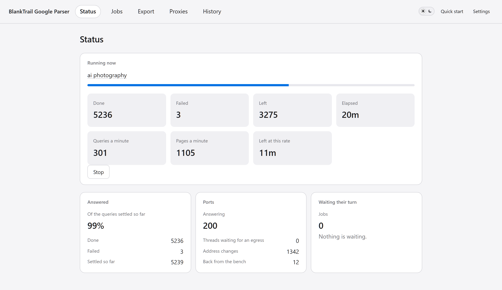
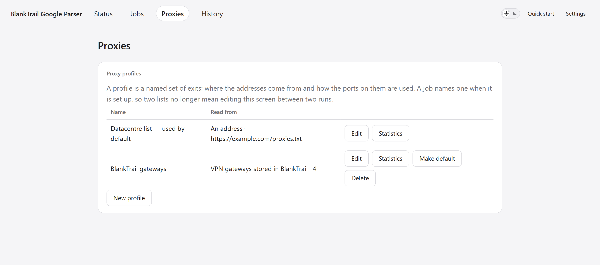

# Google SERP Parser

Open-source **Google search results parser and rank tracker**, written in Go.
Browser interface, CSV/JSON exports, and a SerpApi-compatible HTTP API.
Powered by [BlankTrail Proxy](https://blanktrail.com).

**Русская версия: [README.ru.md](README.ru.md)**

> ⚠️ **This program only works through BlankTrail Proxy with Challenge Breaker.**
> Google serves a JavaScript shell — zero results — to any plain HTTP client, no
> matter how many proxies you put behind it. This was measured, not assumed:
> seven client variants, both direct and proxied, all came back with a 91 KB
> shell containing no results. Results appear only after the solver has carried
> the session through the challenge. A BlankTrail licence including **Challenge
> Breaker** is a hard requirement, not a recommendation.
>
> **Challenge Breaker passes reCAPTCHA.** Counted on a live run: 721 of 821
> challenges solved — 88 per cent — and the identity carries on working
> afterwards, so the next request through it comes back in seconds rather than
> meeting the wall again.



---

## 📜 Recent changes

- A port can be told to **change identity every N minutes**: a fresh
  fingerprint and an empty cookie jar. Nought never does, which suits a long
  address list; choosing the gateways offers ten minutes, because a dozen
  identities held for hours become a dozen an origin knows.
- A job **waits for an identity** rather than spending a query on not having
  one. A pool with everything set aside almost always has something to give
  shortly, and the screen counts who is queueing.
- A port whose listener has gone is **opened again**, and a gateway whose tunnel
  has died is restarted before it is left. Neither used to happen: a restart of
  the proxy service took every port in the job with it.
- **VPN gateways held in BlankTrail** can be used instead of an address list,
  grouped by subscription and ticked one, one subscription, or all at once,
  each showing the round trip the service last measured to it.
- **Threads per proxy** is a setting now. One `ip:port` or one gateway is one
  upstream however many ports sit on it, and threads that find none free wait
  their turn where the status screen can be seen counting them.
- Identities are now reached over **SOCKS5**, so QUIC and far-side DNS work
  through them. HTTP is still selectable as a fallback.
- New **Proxies** tab: live pool figures, failures broken down by kind,
  counters you can zero for a clean measurement, and a one-press ban reset.
- A run is paced by **its own settings**. A job that asks for no pause keeps
  none — the pool it runs on is no longer paced by the standing set's numbers.
- A restart of the proxy service no longer bans the whole address list: a port
  that never answered is told apart from an address that failed.
- Measured on a live 15 000-address list of middling datacentre proxies:
  **500–800 queries a minute at 100 threads, peaking at 1 500, 99% of
  queries answered.** Same pool, same hardware — the reference test client
  does 227.

---

## 📚 Features

### Core

- Three kinds of job:
  - **Parsing** — reads each line as a phrase and saves every result.
  - **Position check** — searches the same phrases and records where a given
    site stands, or that it was not found.
  - **Index check** — reads each line as an address and asks whether Google
    holds it.
- Organic results, ads and related queries, each exportable on its own.
- Pagination to any depth; country and interface language per job.
- Desktop and mobile result pages.
- Jobs queue and run one at a time, on ports that stay open between them.
- A job stops on a button and **carries on from exactly where it stopped**.
- Every result is written down as it lands, so a run that dies keeps everything
  it had established.
- History of every job, searchable and re-exportable at any time.

### Interface

- Browser interface — no command line needed for anything.
- **Status** screen: the job in flight, elapsed against estimated, share
  answered, what came back instead, ports held and ports set aside, threads
  waiting for a free proxy, queue.
- **Proxies** screen: addresses in the list, banned right now, ports open and
  warm; requests, attempts, failure share, address changes, ports opened again;
  failures broken down by kind, with counters you can zero at any moment.
- The gateway list is read once and held for a couple of minutes, with a
  **Refresh** that asks the service again — for when a configuration has just
  been added or the tunnels have just been measured.
- A job that failed can be told to **try the failed queries again**, which is
  not the same button as carrying on with what is left.
- Live URL of the request going out right now.
- English and Russian, switchable in one click.
- The screens show numbers and draw no conclusions from them. They never call a
  run slow — they do not know what you know about your list.

### Proxies and identities

- Address list from a **file or a URL**, re-read on an interval you set.
- Formats accepted: `host:port`, `host:port:user:password`,
  `user:password:host:port`, `user:password@host:port`. A scheme in front
  (`socks5://`, `http://`) is optional; socks5 is assumed.
- **VPN gateways held in BlankTrail** as a third source. The program asks the
  service what it holds and lays the configurations out by the subscription
  they arrived with; tick one, tick a whole subscription, or tick the lot. Each
  shows what it answered when the service last measured it — a number, or the
  word for a gateway that did not answer, or for one nobody has measured.
- Identities are kept **warm between jobs**: a cold identity meets a challenge
  and answers minutes later, a warm one answers in seconds.
- A failed address is banned for a set time and comes back on its own; the ban
  never covers more than three quarters of the list, so the pool cannot run out
  of addresses to try.
- Load is spread evenly: every address is used once before any is used twice.
- **Threads per proxy**, one by default. A unique `ip:port` is one upstream and
  so is one gateway, even where several ports sit on the same machine. Threads
  that find no free upstream wait their turn rather than doubling up on one,
  and the status screen says how many are waiting.
- Failures counted apart, because the remedy differs — a dead address, a proxy
  port that never answered, a relay refusal, a wall from Google, our own
  timeout.
- A port the proxy service is no longer listening on is opened again, and a
  gateway whose tunnel has died is restarted on the same gateway before being
  left: the service runs a gateway only while a port holds it.
- Nothing is spent on an empty pool. A job with no identity to take queues for
  one instead of writing the query down as failed, so a service that goes away
  costs the time it is away and not the rest of the list.



*Three hundred identities, warmed, on a fifteen-thousand-address list: seven
per cent of attempts fail and nearly all of those are addresses that never
answered. The counts were cleared a few minutes before the shot, which is what
the button is for.*

### Export and API

- **CSV**, **JSON Lines**, **TXT** — results, ads and related queries.
- Deduplication by URL or by host, or none.
- HTTP API under `/api/v1/`: set a job going, watch it, stop it, resume it.
- Streaming endpoints: a job's results and a site's history, one JSON object
  per line, so a million rows read a line at a time.
- **SerpApi-compatible** `GET /search`: a program written against that service
  works after changing the base address and nothing else.
- Access by key, issued with `gserp key new`; only a hash is stored.

---

## 🚀 Quick start

No Go, no build, no dependencies. One file to download and one to double-click.

**1. Install and start BlankTrail Proxy** with a licence that includes
Challenge Breaker. Note its control API address (`http://127.0.0.1:8891` by
default) and issue an API key in it.

**2. Download the build for your system.** Every link here always points at
the newest release.

**Windows — one file, nothing to unpack:**

| System | Download |
|---|---|
| Windows, ordinary PC | **[gserp.exe](https://github.com/BlankTrail/google-serp-parser/releases/latest/download/gserp.exe)** |
| Windows on ARM | **[gserp-arm64.exe](https://github.com/BlankTrail/google-serp-parser/releases/latest/download/gserp-arm64.exe)** |

Put it anywhere and double-click it. Everything the program needs is inside
that file — the pages, the icon, the lot — and it writes its history into a
`gserp.db` beside itself.

**Linux and macOS:**

| System | Download |
|---|---|
| Linux, ordinary PC or server | [gserp-linux-amd64.tar.gz](https://github.com/BlankTrail/google-serp-parser/releases/latest/download/gserp-linux-amd64.tar.gz) |
| Linux on ARM | [gserp-linux-arm64.tar.gz](https://github.com/BlankTrail/google-serp-parser/releases/latest/download/gserp-linux-arm64.tar.gz) |
| Mac with Apple silicon (M1 and later) | [gserp-macos-apple-silicon.tar.gz](https://github.com/BlankTrail/google-serp-parser/releases/latest/download/gserp-macos-apple-silicon.tar.gz) |
| Mac with an Intel processor | [gserp-macos-intel.tar.gz](https://github.com/BlankTrail/google-serp-parser/releases/latest/download/gserp-macos-intel.tar.gz) |

Each archive holds the program, a starter script, both READMEs and the licence.
Windows zips are there as well — [amd64](https://github.com/BlankTrail/google-serp-parser/releases/latest/download/gserp-windows-amd64.zip),
[arm64](https://github.com/BlankTrail/google-serp-parser/releases/latest/download/gserp-windows-arm64.zip) — for whoever wants the READMEs
beside the program.

Which version a download is, is on the
[release page](https://github.com/BlankTrail/google-serp-parser/releases/latest)
and in `gserp version`.

**3. Start it.**

- **Windows** — double-click `gserp.exe`. The console goes away, an icon
  appears in the notification area, and your browser opens at
  `http://127.0.0.1:8080`.
- **Linux and macOS** — `./start.sh` in a terminal, or `./gserp serve`.

It listens on this machine only.

### Windows says it protected your PC

It will, and the builds here cannot stop it. SmartScreen judges a program by the
reputation of whoever signed it, and these are unsigned: there is no certificate
to have a reputation. Press *More info* → *Run anyway*.

What you can do instead of taking that on trust is check that the file you have
is the file that was published. Every release carries a `SHA256SUMS.txt`, and
the sum of your copy should be in it:

```
Get-FileHash .\gserp.exe -Algorithm SHA256
```

Windows also marks anything downloaded, which is what raises the prompt. The
mark can be cleared once, per file:

```
Unblock-File .\gserp.exe
```

> macOS keeps downloaded programs quarantined in the same way. If it refuses to
> open the file, clear the mark once with `xattr -d com.apple.quarantine gserp`
> in the unpacked folder. On Linux and macOS the sums are checked with
> `sha256sum -c SHA256SUMS.txt` or `shasum -a 256 -c SHA256SUMS.txt`.

**4. Open Settings** and fill in the BlankTrail address and API key. Press
*Check the connection* — it says what it found rather than only whether it
worked.

**5. Open Proxies** and point it at your address list: a file on this machine
or a URL. Set how often to re-read it, and how long a failed address stays
banned.

**6. Open New job**, paste your phrases or upload a `.txt`, choose the kind of
job, the country, the depth, and the number of threads. The form says what the
run will cost before you start it.


**7. Press Start.** The Status screen follows it. When it is done, download the
results as CSV or JSON Lines from the job's own page.


Prefer to build it yourself? See [Building from source](#-building-from-source).

---

## ⚙️ Settings

### Connection

| Setting | What it is |
|---|---|
| Control API address | Where BlankTrail answers, e.g. `http://127.0.0.1:8891` |
| API key | Issued in BlankTrail. Stored on this machine, never shown again |
| Identities kept warm | Ports held open between jobs. Nought keeps none |
| Result page | Which kind the warm identities are opened for: desktop or mobile |
| Answer the network | Off by default — see [Running it on a server](#-running-it-on-a-server) |
| Password | What the pages ask for from another machine |

### Proxies

| Setting | What it is |
|---|---|
| Read from | Nothing, a file, a URL, or the VPN gateways held in BlankTrail |
| Path or address | Where the list is |
| Re-read every, minutes | How often the list is read again. Nought reads it once |
| Ban for, minutes | How long a failed address is left out. Nought is sixty |
| Threads per proxy | How many threads share one address or one gateway. One by default |
| Change identity every, minutes | How often a port is opened again with a fresh fingerprint and an empty jar. Nought never does; choosing the gateways offers ten |
| Connection to a port | SOCKS5 (default) or HTTP |
| Gateways | Which stored configurations to use, when the source is the gateways |

### Per job

| Setting | What it is |
|---|---|
| Threads | Queries taken at once |
| Ports per thread | Identities opened per thread. Threads × ports = pool size |
| Tries per phrase | How many identities one phrase may be taken to |
| Pause on one identity, seconds | Gap before an identity is asked again. **Nought means none** |
| Pages per query | Depth of pagination |
| Country, language | Two-letter codes, e.g. `de` |
| Deduplication | Keep everything, one row per URL, or one per host |

---

## 🌐 Running it on a server

By default the interface answers **this machine only**: it listens on
`127.0.0.1`, and nothing on the network can reach it. That is the right default
because the pages carry no key of their own — they hold the settings, the queue
and everything every job has collected, and they hand it to whoever opens them.

To use the interface from another machine, open **Settings → Reaching this from
another machine**, tick *Answer the network* and set a password. It takes effect
at the next start, and from then on the program listens on every address this
machine has and asks for the password before showing anything.

- **It cannot be turned on without a password.** The settings refuse the switch
  on its own, and a program started with a switch and no password stays on
  loopback and says so in its first line.
- **This machine is not asked.** A browser on the machine itself goes straight
  in: a password there is a lock on a door you are already inside.
- **The password is not encrypted in transit.** This program speaks plain HTTP,
  so the password travels in every request and anything between can read it.
  Use it on a network you trust, or reach the machine over a VPN or an SSH
  tunnel.
- What is written down is a salt and a PBKDF2-SHA256 derivation, never the
  password. A settings file somebody photographs does not hand it over.

`--addr` still wins over the setting, for the operator who wants a particular
address:

```
gserp serve --addr 0.0.0.0:8080
```

That one opens the port without asking for anything, so put it behind something
that does.

---

## 🖥 Command line

The browser interface needs none of this, but everything is scriptable.

```
gserp run [flags]        work a list of queries, saving each one as it lands
gserp serve [flags]      serve the browser interface and the API
gserp key new [flags]    issue an API key and print it the once it can be seen
gserp key list [flags]   list the keys that exist, without their secrets
gserp key revoke --id N  stop one key working
gserp doctor [flags]     check a BlankTrail instance against an intended run
gserp version            print the version
```

### `gserp run`

| Flag | Meaning |
|---|---|
| `--queries` | File with one query per line; blank lines and `#` are passed over |
| `--db` | History database to write (default `gserp.db`) |
| `--out`, `--format` | File to export into, and `csv` or `jsonl` |
| `--pages` | Result pages per query (default 1) |
| `--threads`, `--ports` | Queries at once, and ports each gets |
| `--country`, `--language` | Two-letter codes |
| `--name` | Name to file the job under |
| `--resume` | Take up the last unfinished job of this name |
| `--dry-run` | Print the estimate and send nothing |

### `gserp serve`

| Flag | Meaning |
|---|---|
| `--addr` | Address to listen on (default `127.0.0.1:8080`) |
| `--db` | History database to open |
| `--threads`, `--ports` | Defaults for a job that names no size |
| `--trace` | Log every request an identity makes: where it waited, what came back |

### Environment

| Variable | Meaning |
|---|---|
| `BLANKTRAIL_URL` | Control API base URL (default `http://127.0.0.1:8891`) |
| `BLANKTRAIL_API_KEY` | API key |
| `GSERP_PROXY_LIST_URL` | Address list to egress through; direct when unset |

The key and the address list are read from the environment and are not flags: a
key on a command line is a key in the shell history.

---

## 🔌 HTTP API

Full reference: [`docs/api.md`](docs/api.md).

Issue a key first:

```
gserp key new --name my-script
```

A single search, in this program's own shape:

```
GET /api/v1/search?q=coffee+grinder&gl=us&hl=en&num=10
Authorization: Bearer <key>
```

The same search in SerpApi's shape:

```
GET /search?q=coffee+grinder&gl=us&hl=en&api_key=<key>
```

Jobs and streams:

```
POST /api/v1/jobs                 set a job going
GET  /api/v1/jobs/{id}            watch it
GET  /api/v1/jobs/{id}/results    stream what it captured, one object per line
GET  /api/v1/history              stream a site's history the same way
```

Three things worth knowing before writing against it:

- **`google` is the only engine.** A request for another is refused with a 400
  that names what was asked for and lists what there is.
- **No advertising is handed over.** The answer says how many paid placements
  were on the page and were not reported, so none go missing silently.
- **A single search does not wait behind the job queue**, but it does compete
  with a running job for ports and has a deadline of its own.

There is no rate limiting, keys have no scopes, and a job is polled rather than
announced.

---

## 🏗 Building from source

Go 1.24 or newer. No cgo, no build tags, no code generation:

```
git clone https://github.com/BlankTrail/google-serp-parser
cd google-serp-parser
go build ./cmd/gserp
```

Cross-compiling is the ordinary Go way:

```
GOOS=linux GOARCH=amd64 CGO_ENABLED=0 go build -o gserp ./cmd/gserp
```

Tests:

```
go test ./...
```

### Attribution

BlankTrail credits a subscription to whoever's work brought the customer, and a
program says which one it is by stamping an *integration key* into the running
service — it travels in the body of the service's licence requests, never in a
link, and it is not a secret.

The downloads above are stamped with this project's key, so a subscription
bought because of the parser is credited to it. A binary you build yourself
carries no key and stamps nothing. Whichever key is in the build, three rules
hold, and you can read them in [`cmd/gserp/integration.go`](cmd/gserp/integration.go):

- a build with no key of its own leaves the service alone;
- a key already stamped by another integrator is never written over;
- nothing about any of it can stop a run — if the service refuses, the parser
  says so once and carries on.

To stamp a build with your own key:

```
go build -ldflags "-X github.com/blanktrail/google-serp-parser/internal/version.integrationKey=dk_yours" ./cmd/gserp
```


---

## 📈 Performance

Measured on a live backconnect list of 15 000 addresses — ordinary datacentre
proxies of middling quality, roughly one address in twelve answering at any
moment — with 100 threads and 300 identities:

| | |
|---|---|
| Queries a minute, sustained | **500–800** |
| Queries a minute, peak | **1 500** |
| Queries answered | **99%** |
| Attempts on the wire per query | 1.0 |
| Failed attempts, warmed pool | 7% |
| Time a thread spends waiting for an identity | 0 |

That is the whole point of the arrangement: the list is not a good one, and it
does not have to be. A dead address costs about two seconds and the next
request goes through another; an identity that has answered keeps answering,
and a challenge is paid for once rather than on every request.

A cold pool starts slow — every identity pays for its one challenge — and
climbs for the first five to ten minutes. That is the shape to expect, not a
fault. Beyond that, what these numbers depend on is your address list and your
BlankTrail licence.

---

## 🛠 Feedback

Bugs and feature requests: please open an issue on GitHub. Include what you
did, what happened, and what you expected — and, if the run was slow, the
figures from the **Proxies** screen, which is what that screen is for.

`gserp serve --trace` logs every request an identity makes: where it waited and
what came back. That log is the fastest way to a diagnosis.

---

## ❤️ About BlankTrail

This parser is open source and free. It exists because Google no longer answers
plain HTTP clients at all, and because the piece that solves that —
[BlankTrail Proxy](https://blanktrail.com) — is worth showing at work rather
than describing.

---

## 📄 Licence

MIT. See [LICENSE](LICENSE).

The software is provided "as is", without warranty of any kind. You are
responsible for how you use it, including for observing the terms of service of
the sites you point it at and the law where you are.
