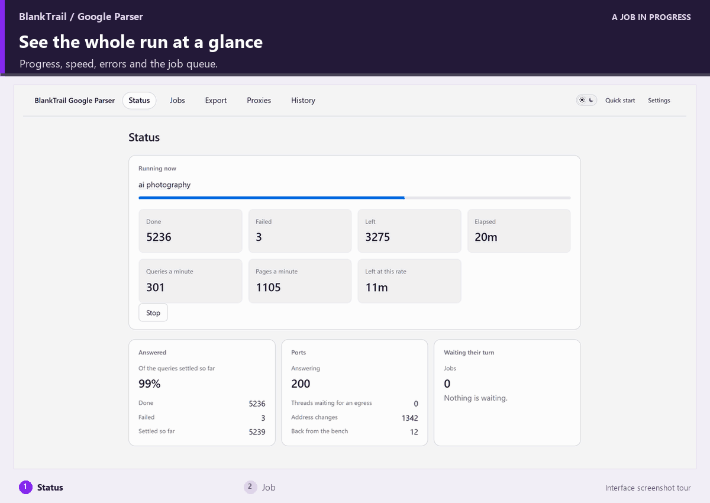
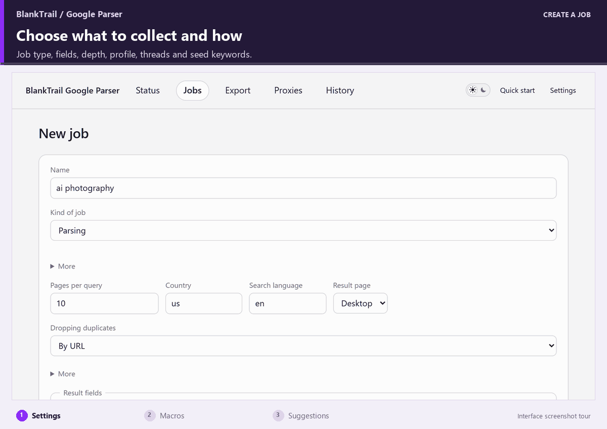
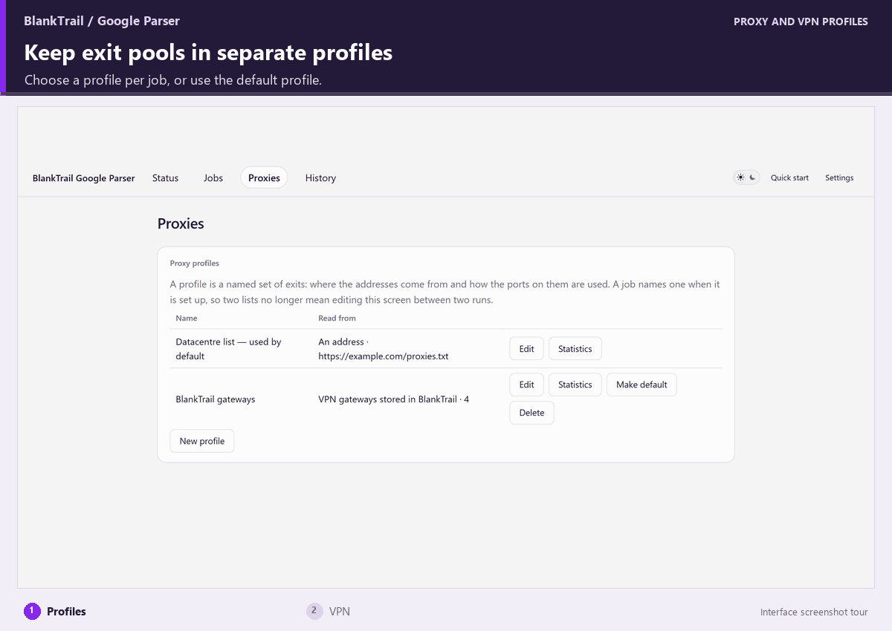

<div align="center">

# Google Parser by BlankTrail — Google SERPs, suggestions, rankings and indexing

**From a keyword to a ready-to-use dataset — in your browser.**

Collect search results and keyword suggestions, check website rankings and page indexing.<br>
Jobs, proxies, live statistics and exports in one local dashboard.

[](https://github.com/BlankTrail/google-serp-parser/releases/latest/download/gserp.exe)
[](https://github.com/BlankTrail/google-serp-parser/releases/latest)
[](LICENSE)

**Google SERPs · Search suggestions · Rank checking · Index checking · CSV / JSONL / TXT**

**English** · [Русский](README.ru.md)

</div>

> **Requires [BlankTrail Proxy](https://blanktrail.com) with a licence that includes [Challenge Breaker](https://blanktrail.com/#features).** The parser itself is free and open source under MIT. The proxy service and exit connections are obtained separately. BlankTrail solves reCAPTCHA locally on Windows and Linux, including servers without a GPU.



<p align="center"><sub>These GIFs use saved screenshots of the actual interface, with smooth scrolling and explanatory captions. Screenshot data is illustrative; the animation does not show requests executing or measure their speed.</sub></p>

Full size: [status dashboard](assets/screenshots/status-en.png) · [job and results](assets/screenshots/job-en.png).

<p align="center">
<a href="#capabilities">Features</a> ·
<a href="#quick-start">Quick start</a> ·
<a href="#first-job">First job</a> ·
<a href="#proxies">Proxies and VPN</a> ·
<a href="#export">Export</a> ·
<a href="#performance">Speed and reCAPTCHA</a> ·
<a href="docs/GUIDE.md">Full guide</a>
</p>

<a id="capabilities"></a>

## What you can do

| Your task | What the parser does | Input |
|---|---|---|
| **Collect Google results** | Saves positions, titles, URLs and snippets; ads and related searches are separate datasets | Keywords, one per line |
| **Collect search suggestions** | Expands keywords with alphabet substitutions and removes duplicates; Multiword adds substitutions between words | Seed keywords |
| **Check website rankings** | Finds your target domain for each keyword within the chosen search depth | Keywords + target domain |
| **Check page indexing** | Checks whether Google returns a specific URL | Page URLs |
| **Prepare data for SEO and analysis** | Lets you select fields, column order, filters and file format, with a preview | Results of any job |
| **Connect your own tool** | Starts and controls jobs through REST; offers single searches in SerpApi format | An HTTP request with an API key |

**Your data stays with you.** Job history and results are stored in SQLite beside the program. Stop a job, resume where it left off or retry only failed requests. The dashboard supports English and Russian, with light and dark themes.

<a id="quick-start"></a>

## Quick start

### 1. Download the program

Ready-made builds need no Go installation, compilation or dependency setup.

| Your system | Download |
|---|---|
| **Windows, Intel / AMD** | **[gserp.exe](https://github.com/BlankTrail/google-serp-parser/releases/latest/download/gserp.exe)** |
| Windows, ARM64 | [gserp-arm64.exe](https://github.com/BlankTrail/google-serp-parser/releases/latest/download/gserp-arm64.exe) |
| Linux, x86-64 | [gserp-linux-amd64.tar.gz](https://github.com/BlankTrail/google-serp-parser/releases/latest/download/gserp-linux-amd64.tar.gz) |
| Linux, ARM64 | [gserp-linux-arm64.tar.gz](https://github.com/BlankTrail/google-serp-parser/releases/latest/download/gserp-linux-arm64.tar.gz) |
| macOS, Apple Silicon | [gserp-macos-apple-silicon.tar.gz](https://github.com/BlankTrail/google-serp-parser/releases/latest/download/gserp-macos-apple-silicon.tar.gz) |
| macOS, Intel | [gserp-macos-intel.tar.gz](https://github.com/BlankTrail/google-serp-parser/releases/latest/download/gserp-macos-intel.tar.gz) |

[All releases](https://github.com/BlankTrail/google-serp-parser/releases) · [SHA256 checksums](https://github.com/BlankTrail/google-serp-parser/releases/latest/download/SHA256SUMS.txt) · [Changelog](CHANGELOG.md)

### 2. Start the parser and BlankTrail

**Windows:** put `gserp.exe` in its own folder and double-click it. The program appears in the notification area and opens your browser.

**Linux / macOS:** unpack the archive and run `./start.sh` or `./gserp serve`.

Dashboard: **[http://127.0.0.1:8080](http://127.0.0.1:8080)**. It is accessible only from this machine by default. [First launch and download verification →](docs/GUIDE.md#quick-start)

Start **[BlankTrail Proxy](https://blanktrail.com)** with Challenge Breaker and leave it running during collection.

### 3. Connect BlankTrail in the parser settings

1. In BlankTrail, open **Settings → API key** and issue or copy a key.
2. Open **Settings** in the parser. Enter the control API address, usually `http://127.0.0.1:8891`, and the key.
3. Press **Check connection**. The dashboard explains if the service is unavailable, the key was rejected or Challenge Breaker is not enabled.

### 4. Choose your exits

Open **Proxies** and configure a profile: a file, a URL-based proxy list or BlankTrail VPN gateways. The parser manages ports, sessions and jobs itself. [Proxy and VPN setup below ↓](#proxies)

<a id="first-job"></a>

## Your first job: from keyword to result



1. Open **Jobs → New job**. Give it a name, for example “Coffee makers — SERPs”.
2. Choose **Parsing**. Enter `coffee maker for home` and `buy coffee maker`, one keyword per line, or upload a `.txt` file.
3. Set the country, language and search type: Desktop or Mobile. One page is enough for a first check.
4. Choose result fields, deduplication and a **proxy profile**. Start with a small number of threads, for example 4.
5. Press **Start**. The job page shows progress, speed, errors, session state and Google challenges.
6. Open **Export**, select the job and save its results as CSV, JSONL or TXT.

**How to tell it is working:** completed requests increase, results appear, and errors and challenges have separate counters. **Stop** keeps collected data; **Resume** finishes what is left. Retrying errors reruns only unsuccessful requests.

[All job settings and macros →](docs/GUIDE.md#first-job) · [Full form in PNG](assets/screenshots/new-job-en.png)

## Four SEO workflows

### Collect results and expand queries

A **Parsing** job can apply several formats to each seed keyword:

```text
{query}
"{query}"
{query} reviews
{query} {ABC:a:z:1}
{query} {num:1:100}
```

Press **+** to add a format. Macros expand before the job starts, and duplicate queries are removed. Organic results, ads and related searches can be selected and exported separately. [Macro examples and limits →](docs/GUIDE.md#first-job)

### Check website rankings

Choose **Position check**, enter a target domain such as `example.com` and supply your keywords. Set the country, language, device and search depth. Results show the site's position or that it was not found within the pages examined. Site history is also available through the API.

### Check page indexing

Choose **Index check** and upload page URLs, one per line. A successful check with a negative result is counted separately from a request that failed. The check reflects Google's response under the job's conditions; a missing URL alone does not prove permanent removal from the index.

### Collect and clean keyword suggestions

Choose **Search suggestions**, enter seed keywords and select a language. **Multiword** adds alphabet substitutions between words. **Requests per key, at most** limits expansion; `0` removes that limit.

Suggestions are deduplicated by text. At export, choose **No filter**, **By words** or **By meaning**. For the meaning filter, download the model in Settings; it runs locally on the CPU. The similarity threshold and preview help you check which suggestions will remain in the file.

[Suggestions, Multiword and the meaning filter →](docs/GUIDE.md#suggestions) · [Form in PNG](assets/screenshots/new-job-suggest-en.png)

<a id="proxies"></a>

## Proxy profiles and VPN



**One profile holds one set of exits and its settings.** Create separate profiles for different proxy lists or VPN connections, then choose a profile when creating a job. The default profile handles jobs that do not select another one, and single searches through the API.

| Source | Setup | Useful for |
|---|---|---|
| **File** | Enter the path to a list, one proxy per line | Your own persistent pool |
| **URL** | Enter the list URL and refresh interval | A provider's regularly updated list |
| **BlankTrail VPN gateways** | Load configurations into BlankTrail, then select gateways in the parser profile | VPN subscriptions or individual configurations |

Each profile has its own failure ban, threads per proxy and port connection protocol. A proxy list can use a first hop: a SOCKS5 proxy or a VPN gateway. VPN configurations are grouped by subscription, with their last measured latency.

**There is no need to assign proxies to BlankTrail ports manually.** The parser opens ports through the control API and keeps sessions with their cookies and fingerprints. The job page shows sessions working, resting or passing a Google challenge; profile statistics distinguish network failures from Google refusals.

[Profiles and first-hop setup →](docs/GUIDE.md#proxy-profiles) · [Full VPN screen](assets/screenshots/proxies-gateways-en.png)

<a id="export"></a>

## Export the data you need

Open **Export → select a job → configure the file**. Preview result parts, columns and their order, delimiters, line endings and Excel BOM before downloading. Saved jobs can be exported again later.

| Format | Use |
|---|---|
| **CSV** | Tables, Excel and analytics tools |
| **JSONL** | Large datasets: one JSON object per line |
| **TXT** | One selected field per line, such as a URL or suggestion |

Deduplicate search results by URL or host, and suggestions by text. Suggestion filters are applied at export, so the saved results remain available without filtering too.

[Export and API →](docs/GUIDE.md#exports)

<a id="performance"></a>

## Measured speed and local reCAPTCHA solving

In the team's demonstration runs for the video overview:

| Mode | Measured speed |
|---|---|
| **Suggestions** | Up to **150,000 requests/min** |
| **SERP parsing** | Around **1,600 requests/min already at 100 threads** |

**100 threads was that run's setting, not a program limit.** Speed depends on the machine, quality and number of exits, job settings and Challenge Breaker capacity. A short job may finish before reaching steady speed; compare long runs after session warm-up. Requests, result pages and captured rows are different counters.

**BlankTrail solves reCAPTCHA locally, without requiring a GPU.** In a separate documented run of 8,514 keywords, it solved 1,899 of 1,936 challenges — **98%**. Sessions continue working after solving. The job page shows challenges passed, being solved or queued, and captchas per thousand pages.

[Previous benchmark conditions, pages per minute and warm-up →](docs/GUIDE.md#performance)

## Questions before you start

**Can it work without BlankTrail?** Collection requires BlankTrail Proxy with Challenge Breaker. No Google or SerpApi API key is needed; the BlankTrail key connects the parser to the proxy service.

**Must I keep the browser open?** The program performs collection. Close the tab and return to the job later. The parser and BlankTrail must keep running.

**Can I use a Linux server?** Yes. The dashboard listens on localhost by default. Enable access from other machines in Settings and set a password. [Server setup →](docs/GUIDE.md#server)

**What about a slow start or errors?** Check the BlankTrail connection, profile and its statistics. Fresh sessions pass challenges before reaching steady speed. The job shows whether threads are waiting for an exit, a session or the solver. [Diagnostics and settings →](docs/GUIDE.md#settings)

## For developers

Written in **Go**, with **SQLite** storage, **REST API `/api/v1/`** and a SerpApi-compatible **`GET /search`**. Issue an access key with `gserp key new`; only its hash is stored. The API starts, stops and resumes jobs, streams results and exposes site history as JSONL.

[API reference](docs/api.md) · [CLI](docs/GUIDE.md#cli) · [Building and reproducible releases](docs/GUIDE.md#building) · [MIT licence](LICENSE)

The GIF tours are built from the screenshots in `assets/screenshots/`. To regenerate them, install Pillow and run `python docs/media/build_readme_gifs.py`. [Generator source](docs/media/build_readme_gifs.py)

Report bugs and feature requests in [GitHub Issues](https://github.com/BlankTrail/google-serp-parser/issues). For speed problems, include job parameters and proxy statistics without keys or passwords.

---

**[Download Google Parser](https://github.com/BlankTrail/google-serp-parser/releases/latest) · [Full guide](docs/GUIDE.md) · [Changelog](CHANGELOG.md) · [BlankTrail Proxy](https://blanktrail.com)**
