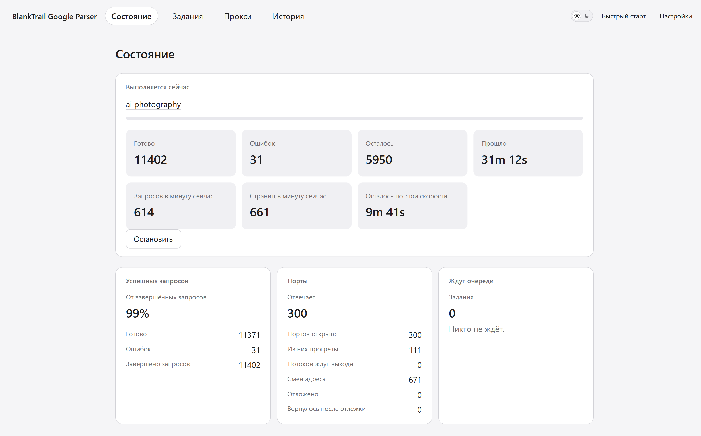
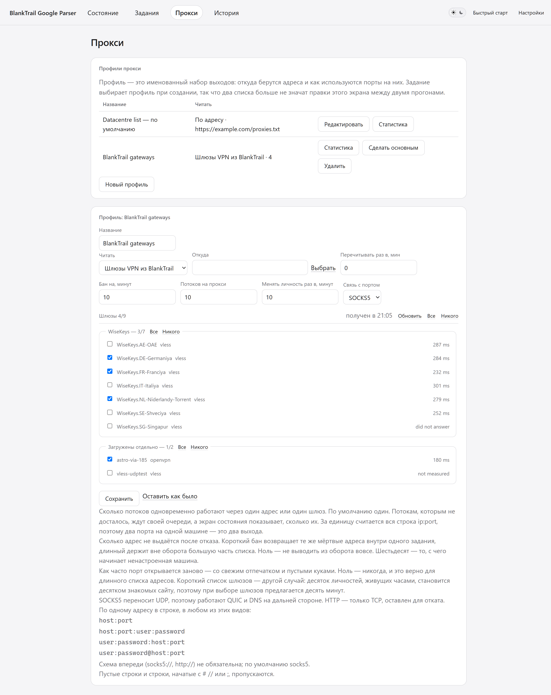

# Парсер выдачи Google

Бесплатный **парсер поисковой выдачи Google и чекер позиций** с открытым
исходным кодом, на Go. Парсит выдачу через свои прокси или через **VPN-шлюзы**,
проверяет **индексацию** страниц и следит за позициями сайта. Браузерный
интерфейс, выгрузка в CSV/JSON, HTTP API, совместимый с SerpApi. Работает через
[BlankTrail Proxy](https://blanktrail.com).

**English version: [README.md](README.md)**

> ⚠️ **Программа работает только через [BlankTrail Proxy](https://blanktrail.com) с [Challenge Breaker](https://blanktrail.com/#features)** — это
> жёсткое требование, а не рекомендация. **Солвер проходит reCAPTCHA:** на живом
> прогоне решён 721 челлендж из 821 — 88%, — и личность после этого продолжает
> работать. Всё остальное настраивается в этой программе, а не в той.



---

## 🚀 Быстрый старт

Это весь путь от «ничего нет» до готового задания. Всё, что ниже, — справочник;
здесь — то, что нужно сделать.

Программы участвуют две, и **настраивается только одна**.
[BlankTrail Proxy](https://blanktrail.com) проводит сессии через челлендж
Google, парсер им управляет. На стороне BlankTrail не настраивается ничего — ни
список прокси, ни порты, ни профили, ни выбор шлюзов. Он должен быть запущен и
должен отдать один ключ. Список адресов, личности, потоки, задания и выгрузки —
всё это живёт на экранах самого парсера.

Ни Go, ни сборки, ни зависимостей. Один файл скачать, один запустить.

### 1. Запустите BlankTrail Proxy и возьмите из него ключ

Установите [BlankTrail Proxy](https://blanktrail.com) с лицензией, включающей
[Challenge Breaker](https://blanktrail.com/#features), и запустите. Дальше
возьмите из него две вещи:

- **адрес control API** — `http://127.0.0.1:8891`, если вы его не переносили;
- **API-ключ** — «Настройки → API-ключ» в BlankTrail. Если ключа ещё нет,
  выпустите.

Это всё, что от него требуется. Порты там создавать **не нужно**, список прокси
туда вставлять **не нужно**, конфигурации VPN там отмечать **не нужно**: парсер
сам открывает и закрывает порты через control API, сам направляет каждый на
выбранный адрес или шлюз и сам закрывает их по окончании задания. Сертификат CA
парсер забирает тоже сам, выгружать его руками не надо.

Оставьте BlankTrail запущенным на время работы. Если он остановлен, парсер
скажет об этом прямо, а не откажет молча.

> Почему без него никак: обычному HTTP-клиенту Google не отдаёт разбираемую
> выдачу вообще. Это замерено, а не предположено: семь вариантов клиента,
> напрямую и через прокси, дали 91-килобайтную JavaScript-оболочку без единого
> результата. Выдача появляется только после того, как солвер провёл сессию
> через челлендж.

### 2. Скачайте сборку под свою систему

Каждая ссылка ведёт на свежий релиз.

**Windows — один файл, распаковывать нечего:**

| Система | Скачать |
|---|---|
| Windows, обычный ПК | **[gserp.exe](https://github.com/BlankTrail/google-serp-parser/releases/latest/download/gserp.exe)** |
| Windows на ARM | **[gserp-arm64.exe](https://github.com/BlankTrail/google-serp-parser/releases/latest/download/gserp-arm64.exe)** |

Положите куда угодно и запустите двойным щелчком. Всё, что нужно программе,
лежит внутри этого файла — страницы, иконка, всё, — а историю она пишет в
`gserp.db` рядом с собой. Положите её в отдельную папку: эта база и файл
настроек рядом с ней — всё состояние программы.

**Linux и macOS:**

| Система | Скачать |
|---|---|
| Linux, обычный ПК или сервер | [gserp-linux-amd64.tar.gz](https://github.com/BlankTrail/google-serp-parser/releases/latest/download/gserp-linux-amd64.tar.gz) |
| Linux на ARM | [gserp-linux-arm64.tar.gz](https://github.com/BlankTrail/google-serp-parser/releases/latest/download/gserp-linux-arm64.tar.gz) |
| Mac на Apple silicon (M1 и новее) | [gserp-macos-apple-silicon.tar.gz](https://github.com/BlankTrail/google-serp-parser/releases/latest/download/gserp-macos-apple-silicon.tar.gz) |
| Mac на процессоре Intel | [gserp-macos-intel.tar.gz](https://github.com/BlankTrail/google-serp-parser/releases/latest/download/gserp-macos-intel.tar.gz) |

В каждом архиве — программа, скрипт запуска, оба README и лицензия. Zip-сборки
под Windows тоже есть — [amd64](https://github.com/BlankTrail/google-serp-parser/releases/latest/download/gserp-windows-amd64.zip),
[arm64](https://github.com/BlankTrail/google-serp-parser/releases/latest/download/gserp-windows-arm64.zip) — для тех, кому README нужен
рядом с программой.

Какая это версия — написано на
[странице релиза](https://github.com/BlankTrail/google-serp-parser/releases/latest)
и говорит `gserp version`.

### 3. Запустите

- **Windows** — двойной щелчок по `gserp.exe`. Консоль скрывается, в трее
  появляется иконка, браузер открывается на `http://127.0.0.1:8080`. Через эту
  же иконку программа и закрывается.
- **Linux и macOS** — `./start.sh` в терминале либо `./gserp serve`, потом
  откройте `http://127.0.0.1:8080` сами.

Слушает программа только эту машину. Доступ с другой — отдельная настройка, и
она выключена, пока вы её не включите: см.
[Запуск на сервере](#-запуск-на-сервере).

На машине, где ещё ничего не запускали, программа **проводит по интерфейсу за
руку**: семь остановок, на каждой — подсказка рядом с тем, о чём она говорит:
экраны, ключ, выходы, откуда заводится задание, что задание спрашивает и где
видно, что до службы вообще достучаться. По одному предложению на шаг.

Переходит не гид, а вы. Остановка на другом экране обводит нажатие, которое туда
ведёт, и ждёт; вы нажимаете — и подсказка переезжает за вами к следующему месту.
Закрыть можно крестиком в любой момент; дальше гид живёт в шапке.

### Windows пишет, что защитил ваш компьютер

Так и будет, и здешние сборки этого не изменят. SmartScreen судит о программе
по репутации того, кто её подписал, а эти не подписаны: сертификата, у которого
могла бы быть репутация, попросту нет. Нажмите «Подробнее» → «Выполнить в любом
случае».

Вместо того чтобы принимать это на веру, можно проверить, что скачанный файл —
именно тот, который выложен. В каждом релизе лежит `SHA256SUMS.txt`, и сумма
вашей копии должна быть в нём:

```
Get-FileHash .\gserp.exe -Algorithm SHA256
```

Windows помечает всё скачанное — именно эта метка и вызывает предупреждение.
Снять её можно один раз, для каждого файла:

```
Unblock-File .\gserp.exe
```

> macOS держит скачанные программы в карантине так же. Если файл отказывается
> открываться, снимите метку один раз командой
> `xattr -d com.apple.quarantine gserp` в распакованной папке. На Linux и macOS
> суммы проверяются через `sha256sum -c SHA256SUMS.txt` или
> `shasum -a 256 -c SHA256SUMS.txt`.

### 4. «Настройки»: покажите, где BlankTrail

Откройте **«Настройки»** — ссылка в правом конце полосы вкладок. Впишите обе
вещи из шага 1:

- **Адрес control API** — `http://127.0.0.1:8891`;
- **API-ключ** — вставьте. Он хранится на этой машине и больше не показывается:
  дальше экран показывает только последние символы, чтобы можно было отличить
  один ключ от другого, не читая его через плечо.

Затем нажмите **«Проверить подключение»**. Оно говорит, что именно нашло, а не
только сработало или нет, и каждый ответ — это разное, что идти и делать:

| Что написано | Что это значит |
|---|---|
| *BlankTrail не отвечает* | Сервис не запущен или отвечает не по этому адресу |
| *BlankTrail не принял API-ключ* | Ключ неверен или перевыпущен. Скопируйте заново из «Настройки → API-ключ» |
| *Лицензия BlankTrail не активирована* | Вот теперь дело действительно в лицензии — активируйте её в кабинете |
| *Challenge Breaker не входит в тариф* | В плане нет солвера, а без него Google отдаёт страницу челленджа вместо данных |
| *Challenge Breaker есть, но выключен* | В плане он есть, но не задано ни одного процесса солвера |
| *Портов больше, чем процессов Challenge Breaker* | Прогон пойдёт, но медленнее: челленджи встанут в очередь |
| Сообщать нечего | Связь работает |

Остальное на этом экране в первый раз можно не трогать:

| Настройка | Что это |
|---|---|
| Личностей держать тёплыми | Порты, остающиеся открытыми между заданиями, чтобы следующее не начиналось с холодного пула. Ноль — не держать |
| Тип выдачи | Для какой выдачи открыты тёплые личности: десктоп или мобильная |
| Доступ с другой машины | По умолчанию выключен. При включении спрашивается пароль |
| Язык интерфейса | Русский или английский. Выбирается здесь и больше нигде |

### 5. «Прокси»: откуда брать выходы

Откройте **«Прокси»**. Сверху — **профили**. Профиль — это именованный набор
выходов — откуда берутся адреса и как используются порты на них, — и
задание выбирает один из них при создании. Один профиль помечен как основной:
на нём идёт задание, не назвавшее профиля, на нём греются постоянные личности и
через него же идёт поиск из HTTP API.

При обновлении один профиль уже есть — `Default`, с теми настройками, с которыми
машина работала. Пока не заведёте второй, в прогонах ничего не меняется.

Под списком — форма, правящая открытый профиль, а под ней — живое состояние
пула во время работы. **«Читать»** выбирает источник, и их три:

- **Файл на этой машине** — по одному адресу в строке. Читаются все эти виды:

  ```
  host:port
  host:port:user:password
  user:password:host:port
  user:password@host:port
  ```

  Схема впереди (`socks5://`, `http://`) необязательна, по умолчанию
  подразумевается `socks5`. Пустые строки и строки, начинающиеся с `#`, `//`
  или `;`, пропускаются — то есть в списке можно держать комментарии.

- **Адрес** — тот же список, забираемый у провайдера по HTTP и перечитываемый с
  заданным интервалом: так ротируемый список остаётся свежим без того, чтобы
  кто-то вставлял его заново.

- **VPN-шлюзы из BlankTrail** — конфигурации, которые уже несёт ваша подписка.
  Они появляются сгруппированными по подпискам, с последним замеренным откликом
  у каждой, и отметить можно одну, целую подписку или все сразу. Шлюзы
  выбираются именно здесь; на стороне BlankTrail не выбирается ничего. Кнопка
  «Обновить» перезапрашивает список и заново меряет отклик.

Остальное в форме — как ведёт себя пул этого профиля. Каждая из этих
настроек принадлежит профилю, так что два списка могут баниться на разное время
и открываться по разным протоколам:

| Настройка | Что делает | С чего начать |
|---|---|---|
| Перечитывать раз в, минут | Как часто перечитывается список по адресу | 30 |
| Бан на, минут | Сколько адрес не выдаётся после отказа. Ноль — не выводить из оборота вовсе | 60 |
| Потоков на прокси | Сколько потоков одновременно делят один адрес или один шлюз | 1 на длинном списке, больше — на коротком |
| Менять личность раз в, минут | Как часто порт открывается заново — со свежим отпечатком и пустыми куками | 60; ноль — никогда, для шлюзов предлагается 10 |
| Связь с портом | SOCKS5 несёт UDP, поэтому работают QUIC и DNS на дальней стороне. HTTP — запасной вариант | SOCKS5 |

Пока задание идёт, верх экрана читает пул: адресов в списке, в бане сейчас,
портов открыто, из них прогрето, в карантине — дальше запросы, попытки на
проводе, доля отказов и разбивка отказов по роду, чтобы адрес, который не
ответил вовсе, отличался от отказа Google. «Обнулить счётчики» начинает
свежий замер, «Снять бан» возвращает в оборот все адреса после перезапуска или
обрыва сети, в которых адреса не виноваты.

### 6. «Новое задание»: первый прогон

Откройте **«Новое задание»**. Форма умещается на один экран и говорит, во что
обойдётся прогон, ещё до запуска.

| Поле | Что вписать |
|---|---|
| Название | Что угодно, по чему вы узнаете задание в истории |
| Тип задания | **Парсинг** — собрать выдачу. **Проверка позиций** — на каком месте стоит сайт по каждой фразе. **Проверка индексации** — есть ли адрес в индексе Google |
| Целевой сайт | Только для проверки позиций: домен, чьё место интересует |
| Откуда берутся фразы | Вставить по одной в строке или загрузить `.txt` |
| Что сохранять из каждого результата | Органика, реклама, похожие запросы — каждое можно сохранять или нет |
| Страна, язык | Двухбуквенные коды, например `de`, `ru` |
| Страниц на запрос | Глубина пагинации. Одна страница — первая десятка результатов |
| Тип выдачи | Десктопная или мобильная |
| Удаление дублей | Оставлять всё, по одной строке на URL или на хост |
| Потоки | Сколько фраз берётся одновременно |
| Портов на поток | Личностей на поток. Потоки × порты — размер пула. По умолчанию три: столько оказалось быстрее всего на замере |
| Попыток на фразу | Через сколько личностей проводится одна фраза, прежде чем она считается неудавшейся |
| Пауза на одной личности, с | Задержка перед повторным обращением. По умолчанию пять: личность, которую спрашивают раз в две секунды, выдержала двенадцать запросов до челленджа, а раз в пять — около сорока. Ноль означает ноль |

Строка под формой говорит, на каком пуле пойдёт задание и во что оно обойдётся.
Прочтите её один раз, прежде чем что-то нажимать: потоки × порты — это сколько
личностей будет заказано у BlankTrail, и это число должно укладываться и в ваш
список адресов, и в число процессов Challenge Breaker.


**Нажмите «Запустить».**

### 7. Пока идёт и когда закончилось

Экран **«Состояние»** следит за заданием: сделано и осталось, текущий url,
запросов и страниц в минуту, пул под ним и сколько потоков ждут личность.
Задание останавливается кнопкой и продолжается с того места, где встало.

Первые минуты — самые медленные. Каждая личность платит за один челлендж при
первом использовании, поэтому холодный пул разгоняется пять–десять минут и
только потом выходит на скорость: прогон, начавшийся медленно, — не сломанный
прогон.

По окончании на странице самого задания — счётчики, настройки, с которыми оно
шло, и результаты, а рядом ссылки **CSV** и **JSON Lines**. Задание,
закончившееся с ошибками, можно попросить пройти неудавшиеся фразы заново, а не
запускать заново целиком.


Хотите собрать сами — см. [Сборка из исходников](#-сборка-из-исходников).


---

## 📜 Последние изменения

- **Светлый интерфейс, тёмный — по желанию.** Интерфейс светлый, а тёмный —
  тумблер в шапке: солнце и луна, ползунок на той стороне, которая включена.
  Выбор запоминается. Раньше он шёл за тем, что скажет
  система вокруг браузера, и оператор с тёмным рабочим столом не мог читать
  программу в светлом.
- **Связь видна на каждом экране.** В шапке написано, что программа последний
  раз узнала о BlankTrail — связь есть, не отвечает, ключ отклонён, лицензия
  неактивна, — а когда с этим надо что-то делать, над экраном появляется баннер
  с переходом прямо в настройки. Спрашивается это в фоне, поэтому ни одна
  страница не ждёт сети, чтобы нарисоваться.
- **Задание без выхода говорит об этом.** Профиль, который пишется при первом
  запуске, берётся из настроек, где ничего не указано, — и свежая машина
  отправляла каждый запрос со своего адреса, а ни один экран об этом не
  сообщал. Теперь есть баннер, и его нажатие открывает поля этого профиля.
- **Сколько собрано** — счётчик на экране задания, рядом со счётчиками запросов:
  «десять тысяч запросов готово» ничего не говорит о том, сколько собрано.
- **Проводка по интерфейсу** на машине, где ещё ничего не запускали: семь
  остановок по одному предложению, каждая рядом с тем, о чём говорит.
- **Разворот адреса переносится на другую личность.** Две трети адресов, которые
  Google скрывает, всё равно не возвращались: разворот уходил одной попыткой
  через одну личность, а ссылки целой страницы идут через одну аренду — поэтому
  мёртвый прокси терял сразу все ссылки страницы. Замер на живом списке: все до
  единого отказы — это адрес, оборвавший соединение, и ни один из них не Google.
  Теперь три личности, а та, что не принесла ничего, выводится из ротации.
- **Профили прокси.** Профиль — это именованный набор выходов, и задание
  выбирает его при создании. Два списка больше не значат правки одного экрана
  между двумя прогонами, а завершённое задание может сказать, через что оно шло. При
  обновлении настройки машины уже лежат в профиле `Default`, и пока не
  заведётся второй, в прогонах ничего не меняется.
- **Отказ в API-ключе теперь так и говорится.** Проверка читала отказ с единственной
  ручки, которая отвечает без ключа, поэтому 401 всегда прилетал следующим
  вызовом и выдавался за нечитаемую лицензию.
- **Адреса, которые Google прячет, теперь добираются.** В некоторых регионах
  выдача приходит с зашифрованной ссылкой без адреса вовсе; шаг, который их
  добирает, был написан, но не вызывался никем.
- **Пауза доезжает до прогона.** Каждое задание, созданное в интерфейсе, шло
  без паузы между двумя запросами на одной личности, что бы ни ввели: коробки
  не было в той двери, которой отправляет браузер.
- Личность выдаётся та, что **уже отвечала**, и ждать её никто не будет. Замер
  на десяти потоках по двадцать минут на руку, в одну минуту: три порта на
  поток дали 259 ответов против 164 у одного порта, а во второй половине, когда
  личности прогрелись, — 154 против 54.
- Порту можно велеть **менять личность раз в N минут**: свежий отпечаток и
  пустые куки. Ноль — никогда, и это верно для длинного списка адресов; при
  выборе шлюзов предлагается десять минут, потому что десяток личностей,
  живущих часами, становится десятком знакомых сайту.
- Задание **ждёт свободную личность**, а не тратит на её отсутствие запрос. У
  пула, где всё отставлено, почти всегда что-то освобождается вскоре, и экран
  показывает, сколько потоков стоит в очереди.
- Порт, чей слушатель пропал, **открывается заново**, а шлюз с умершим туннелем
  перезапускается, прежде чем его оставить. Ни того, ни другого раньше не было:
  перезапуск прокси-службы уносил с собой все порты задания.
- **Шлюзы VPN из BlankTrail** можно взять вместо списка адресов: они
  разложены по подпискам и отмечаются по одному, подпиской или все сразу, а
  рядом с каждым — последний замеренный сервисом отклик.
- **Потоков на прокси** стало настройкой. Один `ip:port` или один шлюз — это
  один выход, сколько бы портов на нём ни было, а потоки без свободного выхода
  ждут очереди, и экран состояния показывает, сколько их.
- Порты теперь используются по **SOCKS5**, поэтому через них работают QUIC и
  разрешение имён на дальней стороне. HTTP остаётся для отката.
- Новая вкладка **Прокси**: состояние пула, разбивка ошибок по типам,
  обнуляемые счётчики для чистого замера и сброс бана одной кнопкой.
- Задание задаёт темп **своими настройками**. Ноль в паузе означает ноль — пул
  больше не наследует темп постоянного тёплого набора.
- Перезапуск прокси-службы больше не отправляет в бан весь список: неответивший
  порт отличается от отказавшего адреса.
- Замер на живом списке из 15 000 серверных прокси среднего качества:
  **500–800 запросов в минуту на 100 потоках, пик 1500, 99% успешных**.
  Тот же пул, то же железо — эталонный тестовый скрипт даёт 227.

---

## 📚 Возможности

### Основные

- Три типа задания:
  - **Парсинг** — читает строку как фразу и сохраняет всю выдачу.
  - **Проверка позиций** — ищет те же фразы и записывает, на каком месте стоит
    заданный сайт или что он не найден.
  - **Проверка индексации** — читает строку как адрес и спрашивает, есть ли он
    у Google.
- Органическая выдача, реклама и похожие запросы — каждое выгружается отдельно.
- Пагинация на любую глубину, страна и язык интерфейса на каждое задание.
- Десктопная и мобильная выдача.
- Задания встают в очередь и идут по одному, на портах, которые остаются
  открытыми между ними.
- Задание останавливается кнопкой и **продолжается ровно с места остановки**.
- Каждый результат пишется сразу, поэтому упавший прогон сохраняет всё, что
  успел собрать.
- История всех заданий: искать и выгружать заново можно в любой момент.

### Интерфейс

- Всё делается в браузере, командная строка не нужна.
- Экран **Состояние**: текущее задание, затраченное время рядом с оценочным,
  доля отвеченных, что пришло вместо выдачи, сколько портов занято и сколько
  отставлено, сколько потоков ждёт свободного прокси, очередь.
- Экран **Прокси**: адресов в списке, забанено сейчас, портов открыто и
  прогрето; запросы, попытки, доля ошибок, смены адреса, портов переоткрыто;
  разбивка ошибок по типам со счётчиками, которые можно обнулить в любой
  момент.
- Список шлюзов читается один раз и держится пару минут, а кнопка **Обновить**
  спрашивает сервис заново — когда только что добавили конфигурацию или
  замерили туннели.
- Заданию с ошибками можно сказать **повторить неудавшиеся запросы**: это
  отдельная кнопка от «Продолжить», которая доделывает оставшееся.
- **Проводка по интерфейсу** для машины, где ещё ничего не запускали: семь
  остановок, каждая — подсказка рядом с тем, о чём речь, на самих экранах, а не
  на странице с их описанием.
- То, что программа последний раз узнала о **BlankTrail**, — в шапке каждого
  экрана, а где с этим надо что-то делать — баннер с одним нажатием.
- Живой URL запроса, который идёт прямо сейчас.
- **Светлый по умолчанию, тёмный по желанию** — тумблер в шапке со значками
  день/ночь, запоминается для этого браузера. Это обычная ссылка, поэтому
  работает и без единой строчки скрипта.
- Русский и английский: тот, что просит браузер, либо выбранный в настройках.
- Экраны показывают цифры и не делают из них выводов. Программа никогда не
  назовёт прогон медленным — она не знает того, что знаете о своём списке вы.

### Прокси и личности

- Список адресов из **файла или по URL**, перечитывается с заданным интервалом.
- Принимаемые форматы: `host:port`, `host:port:user:password`,
  `user:password:host:port`, `user:password@host:port`. Схема впереди
  (`socks5://`, `http://`) не обязательна, по умолчанию socks5.
- **Шлюзы VPN из BlankTrail** как третий источник. Парсер спрашивает сервис, что
  у него есть, и раскладывает конфигурации по подпискам, с которыми они
  пришли: отметить можно одну, целую подписку или все сразу. Рядом с каждым —
  что он ответил при последнем замере: число, либо слово для того, кто не
  ответил, либо для того, кого никто не мерил.
- Личности держатся **тёплыми между заданиями**: холодная встречает челлендж и
  отвечает через минуты, тёплая — за секунды.
- Отказавший адрес уходит в бан на заданное время и возвращается сам; бан
  никогда не покрывает больше трёх четвертей списка, поэтому перебирать всегда
  есть что.
- Нагрузка раскладывается ровно: каждый адрес используется по разу, прежде чем
  какой-то будет использован дважды.
- **Потоков на прокси**, по умолчанию один — и на длинном списке адресов есть
  смысл поднять до двух-трёх: запасные личности спрашиваются реже и живут
  дольше. На коротком списке шлюзов наоборот: больше личностей за одним выходом
  — больше спроса с этого выхода.
- **Потоков на прокси**, по умолчанию один. Уникальная строка `ip:port` — один
  выход, и один шлюз — тоже один, даже если несколько портов живут на одной
  машине. Потоки, которым выхода не досталось, ждут очереди, а не толкаются на
  одном, и экран состояния показывает, сколько их ждёт.
- Ошибки считаются раздельно, потому что лечатся по-разному: мёртвый адрес,
  неответивший порт прокси-службы, отказ в передаче, стена от Google, свой
  таймаут.
- Порт, который прокси-служба больше не слушает, открывается заново, а шлюз с
  умершим туннелем сперва перезапускается на том же шлюзе: сервис держит шлюз
  поднятым, только пока его занимает порт.
- На пустой пул ничего не тратится. Задание, которому не досталось личности,
  встаёт в очередь, а не записывает запрос в неудачные, — поэтому пропавший
  сервис стоит того времени, что он отсутствует, и не стоит остатка списка.


*Триста личностей на списке из пятнадцати тысяч адресов, сотня из них
прогрета: пятая часть попыток отказывает, и 99% этих отказов — адреса, не
донёсшие вообще ничего. Так серверный список выглядит изнутри, и поэтому ошибки
считаются раздельно: Google тут ни при чём, и вежливостью это не лечится.*

Если выбрать шлюзы, на том же экране появляются конфигурации подписки — с
группировкой по подпискам и последним замеренным откликом у каждой:



### Выгрузка и API

- **CSV**, **JSON Lines**, **TXT** — выдача, реклама и похожие запросы.
- Удаление дублей по URL или по хосту либо без него.
- HTTP API под `/api/v1/`: запустить задание, следить, остановить, продолжить.
- Потоковая отдача: результаты задания и история по сайту — по одному
  JSON-объекту на строку, поэтому миллион строк читается построчно.
- **Совместимость с SerpApi**: `GET /search`. Программа, написанная под тот
  сервис, работает после смены базового адреса и больше ничего.
- Доступ по ключу, выдаётся через `gserp key new`; хранится только хеш.

---

## ⚙️ Настройки

### Подключение

| Настройка | Что это |
|---|---|
| Адрес control API | Где отвечает BlankTrail, например `http://127.0.0.1:8891` |
| API-ключ | Выпускается в BlankTrail. Хранится на этой машине и больше не показывается |
| Личностей держать тёплыми | Порты, остающиеся открытыми между заданиями. Ноль — не держать |
| Тип выдачи | Для какой выдачи открыты тёплые личности: десктоп или мобильная |
| Отвечать в сеть | По умолчанию выключено — см. [Запуск на сервере](#-запуск-на-сервере) |
| Пароль | Что спрашивают страницы при заходе с другой машины |
| Язык интерфейса | Русский или английский. Выбирается здесь и больше нигде |

### Прокси

| Настройка | Что это |
|---|---|
| Читать | Ничего, файл, URL или шлюзы VPN из BlankTrail |
| Откуда | Где лежит список |
| Перечитывать раз в, минут | Как часто читать список заново. Ноль — прочитать один раз |
| Бан на, минут | Сколько адрес не выдаётся после отказа. Ноль — не выводить из оборота вовсе; шестьдесят — с чего начинает свежая установка |
| Потоков на прокси | Сколько потоков делят один адрес или один шлюз. По умолчанию один |
| Профиль | Какой именно набор выходов это. Задание называет один; не назвавшее идёт на основном |
| Менять личность раз в, минут | Как часто порт открывается заново — со свежим отпечатком и пустыми куками. По умолчанию шестьдесят, ноль — никогда, при выборе шлюзов предлагается десять |
| Связь с портом | SOCKS5 (по умолчанию) или HTTP |
| Шлюзы | Какие из хранимых конфигураций брать, когда источник — шлюзы |

### На задание

| Настройка | Что это |
|---|---|
| Профиль прокси | Через какой набор выходов идёт задание. Меняется потом на странице самого задания |
| Потоков | Сколько фраз берётся одновременно |
| Портов на поток | Личностей на поток. Потоки × порты = размер пула. По умолчанию три — столько оказалось быстрее всего на замере |
| Попыток на фразу | Через сколько личностей проводится одна фраза |
| Пауза на одной личности, с | Задержка перед повторным обращением. По умолчанию пять: личность, которую спрашивают раз в две секунды, выдержала двенадцать запросов до челленджа, а раз в пять — около сорока. **Ноль означает ноль** |
| Страниц на запрос | Глубина пагинации |
| Страна, язык | Двухбуквенные коды, например `de` |
| Удаление дублей | Оставлять всё, по одной строке на URL или на хост |

---

## 🌐 Запуск на сервере

По умолчанию интерфейс отвечает **только этой машине**: слушает `127.0.0.1`, из
сети до него не достучаться. Это правильное умолчание, потому что своих ключей у
страниц нет — за ними настройки, очередь и всё, что собрали задания, и отдают
они это любому, кто их откроет.

Чтобы работать с интерфейсом с другой машины, откройте **Настройки → Доступ с
другой машины**, поставьте галочку «Отвечать в сеть» и задайте пароль.
Применится при следующем запуске: программа начнёт слушать на всех адресах
машины и будет спрашивать пароль, прежде чем что-либо показать.

- **Без пароля не включается.** Настройки не примут одну галочку, а программа,
  запущенная с включённой галочкой и без пароля, останется на loopback и скажет
  об этом первой же строкой.
- **С самой машины пароль не спрашивают.** Браузер на этой же машине заходит
  сразу: пароль там — замок на двери, за которой вы уже стоите.
- **Пароль не шифруется в пути.** Программа говорит по обычному HTTP, поэтому
  пароль идёт в каждом запросе и читается всем, что стоит между. Пользуйтесь в
  доверенной сети либо подключайтесь по VPN или через SSH-туннель.
- Записывается соль и производная PBKDF2-SHA256, а не пароль. Сфотографированный
  файл настроек его не выдаёт.

`--addr` по-прежнему сильнее настройки — для тех, кому нужен конкретный адрес:

```
gserp serve --addr 0.0.0.0:8080
```

Этот путь открывает порт вообще без вопросов, так что ставьте перед ним что-то,
что их задаёт.

---

## 🖥 Командная строка

Для работы в браузере ничего из этого не нужно, но всё поддаётся скриптованию.

```
gserp run [флаги]        пройти список запросов, сохраняя каждый по мере готовности
gserp serve [флаги]      поднять браузерный интерфейс и API
gserp key new [флаги]    выпустить API-ключ и показать его единственный раз
gserp key list [флаги]   перечислить ключи без секретов
gserp key revoke --id N  отозвать ключ
gserp doctor [флаги]     проверить BlankTrail под задуманный прогон
gserp version            версия
```

### `gserp run`

| Флаг | Смысл |
|---|---|
| `--queries` | Файл с запросами по одному в строке; пустые строки и `#` пропускаются |
| `--db` | База истории (по умолчанию `gserp.db`) |
| `--out`, `--format` | Файл выгрузки и формат: `csv` или `jsonl` |
| `--pages` | Страниц выдачи на запрос (по умолчанию 1) |
| `--threads`, `--ports` | Фраз одновременно и портов на каждую |
| `--country`, `--language` | Двухбуквенные коды |
| `--name` | Под каким именем сохранить задание |
| `--resume` | Продолжить последнее незавершённое задание с этим именем |
| `--dry-run` | Показать оценку и не отправлять ничего |

### `gserp serve`

| Флаг | Смысл |
|---|---|
| `--addr` | Адрес прослушивания (по умолчанию `127.0.0.1:8080`) |
| `--db` | База истории |
| `--threads`, `--ports` | Значения для задания, не назвавшего свои |
| `--trace` | Писать в лог каждый запрос личности: где ждал и что пришло |

### Переменные окружения

| Переменная | Смысл |
|---|---|
| `BLANKTRAIL_URL` | Базовый адрес control API (по умолчанию `http://127.0.0.1:8891`) |
| `BLANKTRAIL_API_KEY` | API-ключ |
| `GSERP_PROXY_LIST_URL` | Список адресов для выхода; без него — напрямую |

Ключ и список читаются из окружения и не являются флагами: ключ в командной
строке — это ключ в истории оболочки.

---

## 🔌 HTTP API

Полное описание: [`docs/api.md`](docs/api.md).

Сначала выпустите ключ:

```
gserp key new --name my-script
```

Одиночный поиск в собственной форме программы:

```
GET /api/v1/search?q=coffee+grinder&gl=us&hl=en&num=10
Authorization: Bearer <ключ>
```

Тот же поиск в форме SerpApi:

```
GET /search?q=coffee+grinder&gl=us&hl=en&api_key=<ключ>
```

Задания и потоки:

```
POST /api/v1/jobs                 запустить задание
GET  /api/v1/jobs/{id}            следить за ним
GET  /api/v1/jobs/{id}/results    поток собранного, по объекту на строку
GET  /api/v1/history              история по сайту тем же способом
```

Три вещи, которые стоит знать заранее:

- **Движок только `google`.** Запрос другого получает 400 с названием
  запрошенного и перечнем существующих.
- **Реклама не отдаётся.** В ответе сказано, сколько платных мест было на
  странице и не попало в выдачу, — молча не теряется ничего.
- **Одиночный поиск не ждёт очереди заданий**, но конкурирует с работающим
  заданием за порты и имеет собственный срок.

Ограничения скорости нет, области действия у ключей нет, о готовности задания
нужно спрашивать самому.

---

## 🏗 Сборка из исходников

Go 1.26 или новее. Без cgo, без тегов сборки, без кодогенерации:

```
git clone https://github.com/BlankTrail/google-serp-parser
cd google-serp-parser
go build ./cmd/gserp
```

Кросс-сборка — обычным способом Go:

```
GOOS=linux GOARCH=amd64 CGO_ENABLED=0 go build -o gserp ./cmd/gserp
```

Тесты:

```
go test ./...
```

Если установлен [`just`](https://github.com/casey/just), то `just --list`
покажет то же самое под короткими именами: `just build`, `just test`,
`just lint`.

### Как собрать релиз самому

Выложенные сборки делает [`scripts/dist.sh`](scripts/dist.sh) — тот же скрипт
запускает и релизный workflow, отдельного рецепта, который виден только CI, не
существует. Собрать те же артефакты у себя:

```
git checkout v0.1.0
./scripts/dist.sh 0.1.0
cd dist && sha256sum -c SHA256SUMS.txt
```

Суммы проверяются изнутри `dist/`, потому что имена файлов в них записаны без
каталога — именно поэтому тем же файлом можно проверить и релиз, скачанный в
любую свою папку.

Бинарники собираются с `-trimpath`, поэтому не хранят следов машины, на которой
собраны, и у двух человек из одного тега получается один и тот же файл. Архивы
побайтово не воспроизводятся — в них записано время упаковки, — так что
сравнивать нужно бинарники внутри, а не сами архивы. От выложенной сборки ваша
намеренно отличается одним: в ней нет метки разработчика, о которой следующий
раздел.

### Метка разработчика

BlankTrail засчитывает подписку тому, чья работа привела клиента, и программа
называет себя *ключом интеграции*: он едет в теле лицензионных запросов сервиса,
не в ссылке, и секретом не является.

Сборки по ссылкам выше помечены ключом этого проекта — подписка, купленная
ради парсера, засчитывается ему. Собранный вами бинарник ключа не несёт и
ничего не проставляет. С любым ключом действуют три правила, они читаются
целиком в [`cmd/gserp/integration.go`](cmd/gserp/integration.go):

- сборка без собственного ключа сервис не трогает;
- чужой ключ, уже проставленный другим разработчиком, не перезаписывается;
- ничего из этого не может остановить работу — если сервис отказал, парсер
  говорит об этом один раз и продолжает.

Пометить сборку своим ключом:

```
go build -ldflags "-X github.com/blanktrail/google-serp-parser/internal/version.integrationKey=dk_ваш" ./cmd/gserp
```

`scripts/dist.sh` берёт тот же ключ из `GSERP_INTEGRATION_KEY`, а если она не
задана — не проставляет ничего. Именно так и должна вести себя сборка, сделанная
не этим проектом: и у вас на машине, и в релизном workflow форка.


---

## 📈 Производительность

Замер на живом backconnect-списке из 15 000 адресов — обычные серверные прокси
среднего качества, отвечает примерно один адрес из двенадцати в каждый момент —
на 100 потоках и 300 личностях:

| | |
|---|---|
| Запросов в минуту, устойчиво | **500–800** |
| Запросов в минуту, пик | **1500** |
| Доля успешных запросов | **99%** |
| Попыток на проводе на один запрос | 1.0 |
| Доля попыток с ошибкой, прогретый пул | 7% |
| Время потока в ожидании личности | 0 |

В этом и смысл устройства: список неважный, и таким он и должен быть. Мёртвый
адрес стоит около двух секунд, следующий запрос уходит через другой; адрес,
который ответил, продолжает отвечать, а челлендж оплачивается один раз, а не на
каждом запросе.

Холодный пул стартует медленно — каждая личность платит за свой один челлендж —
и разгоняется первые пять–десять минут. Это нормальная форма разгона, а не
неисправность. Дальше цифры зависят от вашего списка адресов и лицензии
BlankTrail.

---

## 🛠 Обратная связь

Об ошибках и пожеланиях — issue на GitHub. Опишите, что делали, что произошло и
чего ждали; если прогон был медленным, приложите цифры с экрана **Прокси** —
он ровно для этого и сделан.

`gserp serve --trace` пишет в лог каждый запрос личности: где ждал и что
пришло. Это самый быстрый путь к диагнозу.

---

## ❤️ О BlankTrail

Парсер открытый и бесплатный. Он существует потому, что Google больше не
отвечает обычным HTTP-клиентам, и потому, что решающую эту задачу часть —
[BlankTrail Proxy](https://blanktrail.com) — лучше показать в работе, чем
описать словами.

---

## 📄 Лицензия

MIT, см. [LICENSE](LICENSE).

Программа предоставляется «как есть», без каких-либо гарантий. Ответственность
за использование, включая соблюдение условий обслуживания сайтов и
законодательства вашей юрисдикции, лежит на вас.
