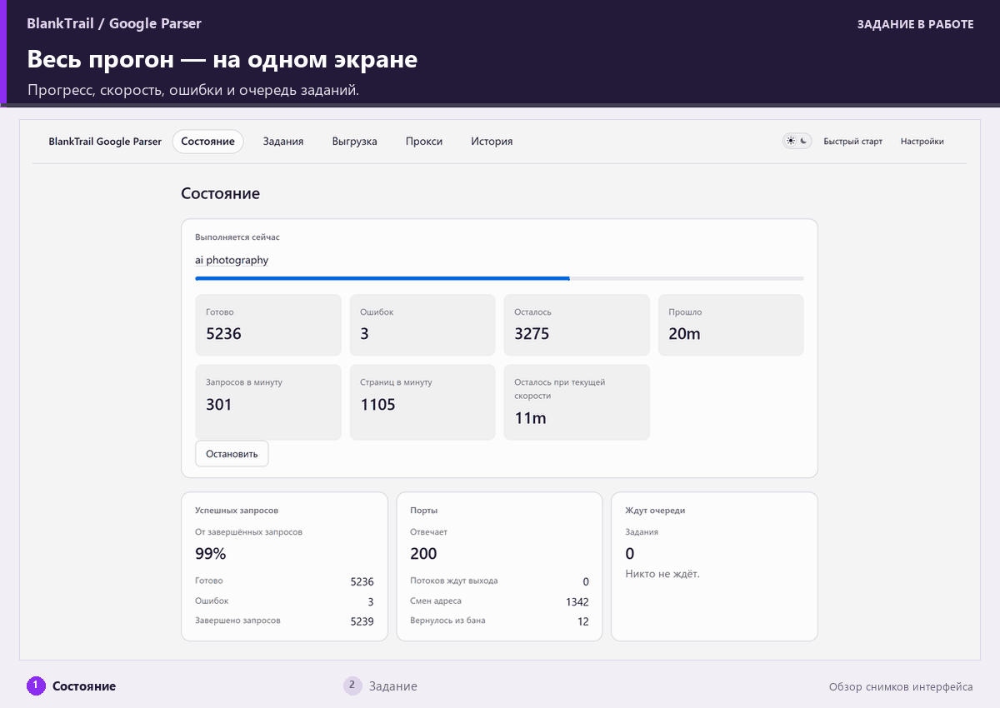
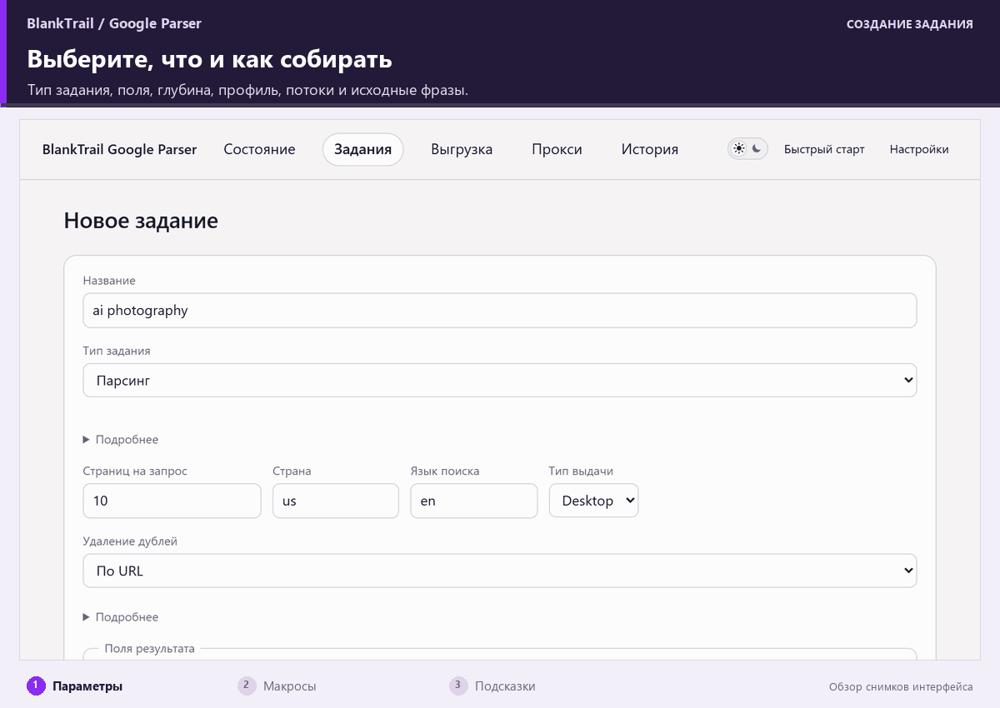
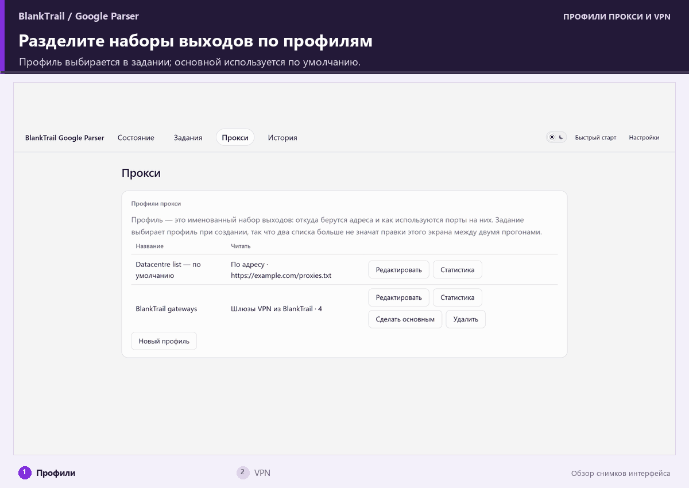

<div align="center">

# Google Parser от BlankTrail — парсер Google, подсказки, позиции и индексация

**От ключевой фразы до готовой таблицы — в вашем браузере.**

Собирайте поисковую выдачу и семантику, проверяйте позиции сайта и индексацию страниц.<br>
Задания, прокси, статистика и выгрузка — в одной локальной панели.

[](https://github.com/BlankTrail/google-serp-parser/releases/latest/download/gserp.exe)
[](https://github.com/BlankTrail/google-serp-parser/releases/latest)
[](LICENSE)

**Выдача Google · Поисковые подсказки · Проверка позиций · Проверка индексации · CSV / JSONL / TXT**

[English](README.md) · **Русский**

</div>

> **Для работы нужен [BlankTrail Proxy](https://blanktrail.com) с лицензией, включающей [Challenge Breaker](https://blanktrail.com/#features).** Сам парсер бесплатный и открытый, MIT. Прокси-служба и каналы выхода подключаются отдельно. Решение reCAPTCHA выполняет BlankTrail локально: на Windows и Linux, в том числе на сервере без GPU.

## Полный видеообзор

[](https://www.youtube.com/watch?v=Q9lzVXBSHiQ)

**[▶ Смотреть обзор на YouTube](https://www.youtube.com/watch?v=Q9lzVXBSHiQ)** — интерфейс и настройки, подключение BlankTrail, профили прокси и VPN, выполнение реальных заданий, скорость сбора и выгрузка данных.

## Интерфейс в работе



<p align="center"><sub>GIF собраны из сохранённых снимков настоящего интерфейса с плавной прокруткой и пояснениями. Данные на снимках — демонстрационные примеры; анимация не показывает выполнение запросов или их скорость.</sub></p>

Полный размер: [состояние](assets/screenshots/status-ru.png) · [задание и результаты](assets/screenshots/job-ru.png).

<p align="center">
<a href="#capabilities">Возможности</a> ·
<a href="#quick-start">Быстрый старт</a> ·
<a href="#first-job">Первое задание</a> ·
<a href="#proxies">Прокси и VPN</a> ·
<a href="#export">Выгрузка</a> ·
<a href="#performance">Скорость и reCAPTCHA</a> ·
<a href="docs/GUIDE.ru.md">Полное руководство</a>
</p>

<a id="capabilities"></a>

## Что можно сделать

| Ваша задача | Что делает парсер | Что подать на вход |
|---|---|---|
| **Собрать выдачу Google** | Сохраняет позиции, заголовки, URL и сниппеты; отдельно — рекламу и похожие запросы | Ключевые фразы, по одной в строке |
| **Собрать поисковые подсказки** | Разворачивает ключи буквенными подстановками, удаляет дубли; Multiword добавляет подстановки между словами | Исходные ключевые фразы |
| **Проверить позиции сайта** | Находит целевой домен в выдаче по каждой фразе на выбранной глубине | Фразы + домен сайта |
| **Проверить индексацию страниц** | Проверяет, находится ли конкретный URL в Google | Список адресов страниц |
| **Подготовить данные для SEO и аналитики** | Даёт выбрать поля, порядок колонок, фильтры и формат файла с предпросмотром | Результаты любого задания |
| **Подключить свой инструмент** | Запуск и контроль заданий через REST API; одиночный поиск в формате SerpApi | HTTP-запрос с API-ключом |

**Данные хранятся у вас.** История заданий и результаты записываются в SQLite рядом с программой. Задание можно остановить, продолжить с места остановки и отдельно повторить неудавшиеся запросы. Интерфейс поддерживает русский и английский, светлую и тёмную тему.

<a id="quick-start"></a>

## Быстрый старт

### 1. Скачайте программу

Go, сборка и установка зависимостей для готовой версии не нужны.

| Ваша система | Скачать |
|---|---|
| **Windows, Intel / AMD** | **[gserp.exe](https://github.com/BlankTrail/google-serp-parser/releases/latest/download/gserp.exe)** |
| Windows, ARM64 | [gserp-arm64.exe](https://github.com/BlankTrail/google-serp-parser/releases/latest/download/gserp-arm64.exe) |
| Linux, x86-64 | [gserp-linux-amd64.tar.gz](https://github.com/BlankTrail/google-serp-parser/releases/latest/download/gserp-linux-amd64.tar.gz) |
| Linux, ARM64 | [gserp-linux-arm64.tar.gz](https://github.com/BlankTrail/google-serp-parser/releases/latest/download/gserp-linux-arm64.tar.gz) |
| macOS, Apple Silicon | [gserp-macos-apple-silicon.tar.gz](https://github.com/BlankTrail/google-serp-parser/releases/latest/download/gserp-macos-apple-silicon.tar.gz) |
| macOS, Intel | [gserp-macos-intel.tar.gz](https://github.com/BlankTrail/google-serp-parser/releases/latest/download/gserp-macos-intel.tar.gz) |

[Все релизы](https://github.com/BlankTrail/google-serp-parser/releases) · [Контрольные суммы SHA256](https://github.com/BlankTrail/google-serp-parser/releases/latest/download/SHA256SUMS.txt) · [История изменений](CHANGELOG.ru.md)

### 2. Запустите парсер и BlankTrail

**Windows:** положите `gserp.exe` в отдельную папку и запустите двойным щелчком. Программа появится в области уведомлений и откроет браузер.

**Linux / macOS:** распакуйте архив и выполните `./start.sh` или `./gserp serve`.

Панель: **[http://127.0.0.1:8080](http://127.0.0.1:8080)**. По умолчанию она доступна только с этой машины. [Первый запуск и проверка скачанного файла →](docs/GUIDE.ru.md#quick-start)

Запустите **[BlankTrail Proxy](https://blanktrail.com)** с Challenge Breaker и оставьте его работающим во время сбора.

### 3. Подключите BlankTrail в настройках парсера

1. В BlankTrail откройте **Настройки → API-ключ** и выпустите или скопируйте ключ.
2. В парсере откройте **Настройки**. Укажите адрес control API, обычно `http://127.0.0.1:8891`, и ключ.
3. Нажмите **Проверить подключение**. Панель подскажет, если служба недоступна, ключ не принят или Challenge Breaker не включён.

### 4. Выберите выходы

Откройте **Прокси** и настройте профиль: список из файла, список по URL или VPN-шлюзы BlankTrail. Порты, сессии и задания управляются самим парсером. [Прокси и VPN по шагам ↓](#proxies)

<a id="first-job"></a>

## Первое задание: от фразы до результата



1. Откройте **Задания → Новое задание**. Назовите его, например «Кофемашины — выдача».
2. Выберите **Парсинг**. Вставьте `кофемашина для дома` и `купить кофемашину`, по одной фразе в строке, или загрузите `.txt`.
3. Укажите страну, язык и тип выдачи: Desktop или Mobile. Для первой проверки достаточно одной страницы.
4. Выберите поля результата, удаление дублей и **профиль прокси**. Для знакомства начните с небольшого числа потоков, например 4.
5. Нажмите **Запустить**. На странице задания появятся прогресс, скорость, ошибки, состояние сессий и проверки Google.
6. Откройте **Выгрузка**, выберите задание и сохраните результат в CSV, JSONL или TXT.

**Как понять, что всё работает:** растёт число выполненных запросов, появляются результаты, а ошибки и проверки видны отдельно. **Стоп** сохраняет собранное; **Продолжить** доделывает оставшееся. Кнопка повторения ошибок заново проходит только неудавшиеся запросы.

[Все параметры задания и макросы →](docs/GUIDE.ru.md#first-job) · [Полная форма в PNG](assets/screenshots/new-job-ru.png)

## Четыре сценария для SEO

### Собрать выдачу и расширить запросы

Тип **Парсинг** позволяет задать несколько форматов для каждой исходной фразы:

```text
{query}
"{query}"
{query} отзывы
{query} {ABC:а:я:1}
{query} {num:1:100}
```

Кнопка **+** добавляет формат. Макросы разворачиваются до запуска, одинаковые запросы удаляются. Органика, реклама и похожие запросы выбираются и выгружаются отдельно. [Примеры и ограничения макросов →](docs/GUIDE.ru.md#first-job)

### Проверить позиции сайта

Выберите **Проверка позиций**, укажите целевой домен, например `example.com`, и список фраз. Задайте страну, язык, устройство и глубину поиска. Результат показывает место сайта либо отсутствие в просмотренной части выдачи. Историю по сайту можно читать через API.

### Проверить индексацию страниц

Выберите **Проверка индексации** и загрузите адреса страниц, по одному в строке. Успешная проверка с отрицательным результатом и запрос, завершившийся ошибкой, учитываются отдельно. Проверка отражает ответ Google в условиях задания; отсутствие URL в ответе само по себе не доказывает его окончательное исключение из индекса.

### Собрать и очистить семантику

Выберите **Поисковые подсказки**, вставьте исходные ключи и выберите язык. **Multiword** добавляет буквенные подстановки между словами, а **Запросов на ключ, не больше** ограничивает объём расширения; `0` снимает это ограничение.

Дубли удаляются по тексту. При выгрузке выберите **Без фильтра**, **По словам** или **По смыслу**. Для смыслового фильтра скачайте модель в настройках; она работает локально на CPU. Порог близости и предпросмотр помогают проверить, какие подсказки останутся в файле.

[Подсказки, Multiword и смысловой фильтр →](docs/GUIDE.ru.md#suggestions) · [Форма в PNG](assets/screenshots/new-job-suggest-ru.png)

<a id="proxies"></a>

## Профили прокси и VPN



**Один профиль — один набор выходов и его настройки.** Создайте отдельные профили для разных списков или VPN, затем выбирайте нужный при создании задания. Основной профиль используется, если задание не выбрало другой, и для одиночного поиска через API.

| Источник | Как подключить | Когда удобно |
|---|---|---|
| **Файл** | Укажите путь к списку, по одному прокси в строке | Собственный постоянный пул |
| **URL** | Укажите адрес списка и интервал перечитывания | Список, обновляемый провайдером |
| **VPN-шлюзы BlankTrail** | Загрузите конфигурации в BlankTrail, затем выберите шлюзы в профиле парсера | Выходы из VPN-подписок или отдельных конфигураций |

В каждом профиле задаются бан после отказа, потоки на прокси и протокол связи с портом. Список можно направить через первый хоп — SOCKS5-прокси или VPN-шлюз. VPN-конфигурации показаны по подпискам с последним измеренным откликом.

**Прокси не нужно вручную раскладывать по портам в BlankTrail.** Парсер сам открывает порты через control API и сохраняет сессии с куками и отпечатками. На странице задания видно, сколько сессий в работе, на отдыхе и проходит проверку Google; статистика профиля разделяет сетевые ошибки и отказы Google.

[Настройка профилей и первого хопа →](docs/GUIDE.ru.md#proxy-profiles) · [Полный экран VPN](assets/screenshots/proxies-gateways-ru.png)

<a id="export"></a>

## Выгрузка: оставьте только нужные данные

Откройте **Выгрузка → выберите задание → настройте файл**. До скачивания виден предпросмотр: части результата, колонки и их порядок, разделители, переводы строк и BOM для Excel. Сохранённое задание можно выгружать повторно.

| Формат | Для чего |
|---|---|
| **CSV** | Таблицы, Excel, импорт в аналитические инструменты |
| **JSONL** | Обработка больших объёмов: один JSON-объект в строке |
| **TXT** | Одно выбранное поле в строке: например, URL или подсказка |

Выдачу можно очищать от дублей по URL или хосту, подсказки — по тексту. Фильтры подсказок применяются при выгрузке, поэтому сохранённый результат доступен и без фильтра.

[Выгрузка и API →](docs/GUIDE.ru.md#exports)

<a id="performance"></a>

## Реальная скорость и локальное решение reCAPTCHA

В демонстрационных прогонах команды для видеообзора:

| Режим | Измеренная скорость |
|---|---|
| **Сбор подсказок** | До **150 000 запросов/мин** |
| **Парсинг выдачи** | Около **1 600 запросов/мин уже при 100 потоках** |

**100 потоков — настройка этого прогона, а не предел программы.** Скорость зависит от машины, качества и количества выходов, параметров задания и ресурсов Challenge Breaker. Короткое задание может закончиться до разгона; для сравнения смотрите статистику длительного прогона после прогрева сессий. Запросы, страницы выдачи и строки результата — разные счётчики.

**reCAPTCHA решается локально через BlankTrail, без обязательного GPU.** В другом документированном прогоне на 8 514 фразах решено 1 899 из 1 936 проверок — **98%**. Сессии после проверки продолжают работать. На странице задания доступны счётчики пройденных, решаемых и ожидающих проверок, а также число каптч на тысячу страниц.

[Условия предыдущего замера, страницы в минуту и разгон →](docs/GUIDE.ru.md#performance)

## Вопросы перед запуском

**Можно работать без BlankTrail?** Для сбора нужен BlankTrail Proxy с Challenge Breaker. API-ключ Google или SerpApi не требуется; ключ BlankTrail подключает парсер к прокси-службе.

**Нужно постоянно держать браузер открытым?** Сбор выполняет программа. Можно закрыть вкладку, а затем вернуться к заданию. Сам парсер и BlankTrail должны продолжать работать.

**Можно поставить на Linux-сервер?** Да. По умолчанию панель слушает localhost. Для доступа с другой машины включите соответствующую настройку и задайте пароль. [Запуск на сервере →](docs/GUIDE.ru.md#server)

**Что делать с медленным стартом или ошибками?** Проверьте подключение BlankTrail, профиль и его статистику. Свежие сессии проходят проверки перед выходом на рабочую скорость. В задании видно, ждут ли потоки выход, сессию или решатель. [Диагностика и настройки →](docs/GUIDE.ru.md#settings)

## Для разработчиков

Парсер написан на **Go**, хранит результаты в **SQLite** и предоставляет **REST API `/api/v1/`** и совместимый с SerpApi **`GET /search`**. Ключ доступа выпускается командой `gserp key new`; в базе хранится только его хеш. API умеет запускать, останавливать и продолжать задания, отдавать результаты и историю потоком JSONL.

[Полное описание API](docs/api.md) · [CLI](docs/GUIDE.ru.md#cli) · [Сборка и воспроизводимые релизы](docs/GUIDE.ru.md#building) · [Лицензия MIT](LICENSE)

GIF-обзоры собираются из снимков в `assets/screenshots/`. Для обновления установите Pillow и выполните `python docs/media/build_readme_gifs.py`. [Исходник генератора](docs/media/build_readme_gifs.py)

Об ошибках и пожеланиях сообщайте в [GitHub Issues](https://github.com/BlankTrail/google-serp-parser/issues). Для проблем со скоростью приложите параметры задания и статистику прокси без ключей и паролей.

---

**[Скачать Google Parser](https://github.com/BlankTrail/google-serp-parser/releases/latest) · [Полное руководство](docs/GUIDE.ru.md) · [История изменений](CHANGELOG.ru.md) · [BlankTrail Proxy](https://blanktrail.com)**
