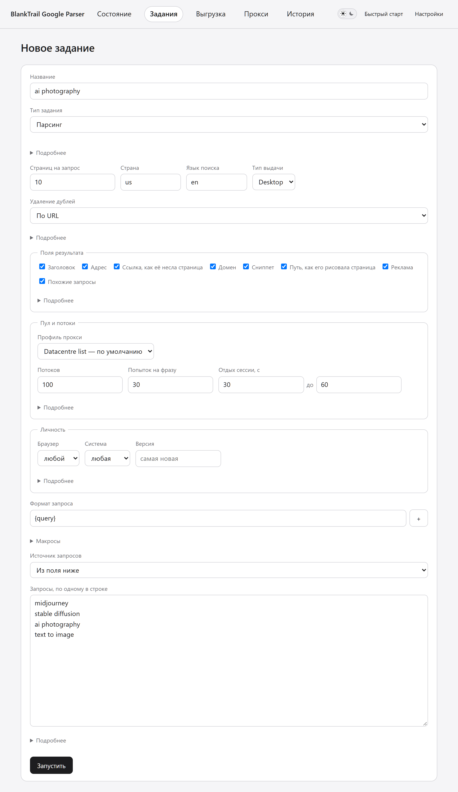
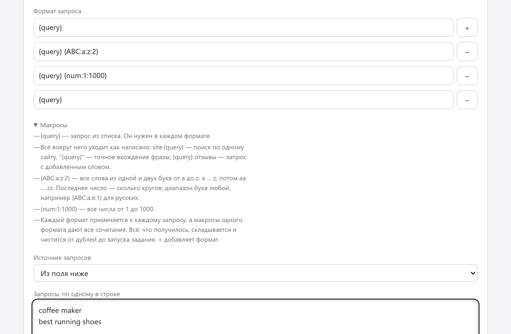
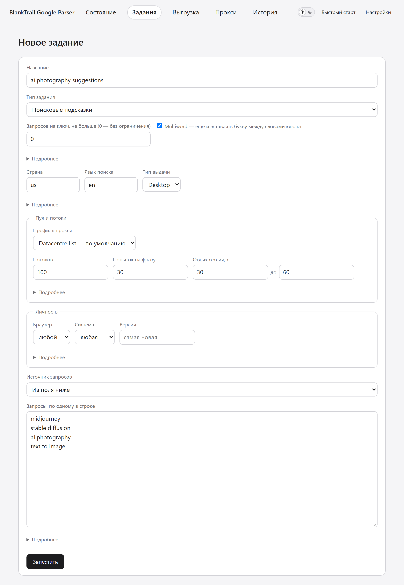
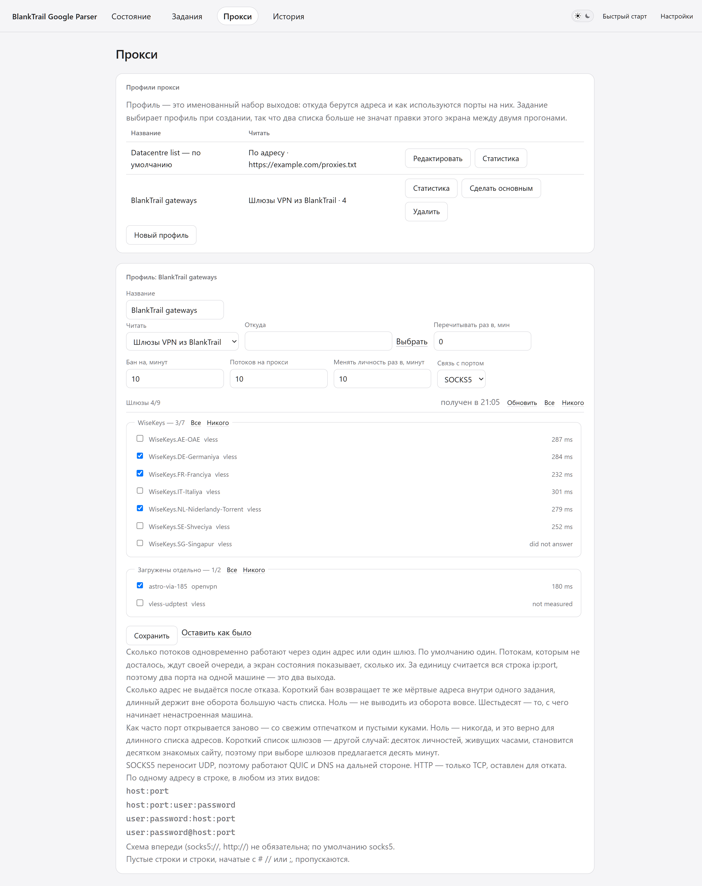

# Полное руководство — Google Parser от BlankTrail

[← Главная](../README.ru.md) · [English](GUIDE.md) · [История изменений](../CHANGELOG.ru.md)

<a id="quick-start"></a>

## 🚀 Быстрый старт

Это весь путь от «ничего нет» до готового задания. Всё, что ниже, — справочник;
здесь — то, что нужно сделать.

Программы участвуют две, и **настраивается только одна**.
[BlankTrail Proxy](https://blanktrail.com) проводит сессии через челлендж
Google, парсер им управляет. На стороне BlankTrail не настраивается ничего — ни
список прокси, ни порты, ни профили, ни выбор шлюзов. Он должен быть запущен и
должен отдать один ключ. Список адресов, личности, потоки, задания и выгрузки —
всё это живёт на экранах самого парсера.

Ни Go, ни сборки, ни зависимостей. Один файл скачать, один запустить.

### 1. Запустите BlankTrail Proxy и возьмите из него ключ

Установите [BlankTrail Proxy](https://blanktrail.com) с лицензией, включающей
[Challenge Breaker](https://blanktrail.com/#features), и запустите. Дальше
возьмите из него две вещи:

- **адрес control API** — `http://127.0.0.1:8891`, если вы его не переносили;
- **API-ключ** — «Настройки → API-ключ» в BlankTrail. Если ключа ещё нет,
  выпустите.

Это всё, что от него требуется. Порты там создавать **не нужно**, список прокси
туда вставлять **не нужно**, конфигурации VPN там отмечать **не нужно**: парсер
сам открывает и закрывает порты через control API, сам направляет каждый на
выбранный адрес или шлюз и сам закрывает их по окончании задания. Сертификат CA
парсер забирает тоже сам, выгружать его руками не надо.

Оставьте BlankTrail запущенным на время работы. Если он остановлен, парсер
скажет об этом прямо, а не откажет молча.

> Почему без него никак: обычному HTTP-клиенту Google не отдаёт разбираемую
> выдачу вообще. Это замерено, а не предположено: семь вариантов клиента,
> напрямую и через прокси, дали 91-килобайтную JavaScript-оболочку без единого
> результата. Выдача появляется только после того, как солвер провёл сессию
> через челлендж.

### 2. Скачайте сборку под свою систему

Каждая ссылка ведёт на свежий релиз.

**Windows — один файл, распаковывать нечего:**

| Система | Скачать |
|---|---|
| Windows, обычный ПК | **[gserp.exe](https://github.com/BlankTrail/google-serp-parser/releases/latest/download/gserp.exe)** |
| Windows на ARM | **[gserp-arm64.exe](https://github.com/BlankTrail/google-serp-parser/releases/latest/download/gserp-arm64.exe)** |

Положите куда угодно и запустите двойным щелчком. Всё, что нужно программе,
лежит внутри этого файла — страницы, иконка, всё, — а историю она пишет в
`gserp.db` рядом с собой. Положите её в отдельную папку: эта база и файл
настроек рядом с ней — всё состояние программы.

**Linux и macOS:**

| Система | Скачать |
|---|---|
| Linux, обычный ПК или сервер | [gserp-linux-amd64.tar.gz](https://github.com/BlankTrail/google-serp-parser/releases/latest/download/gserp-linux-amd64.tar.gz) |
| Linux на ARM | [gserp-linux-arm64.tar.gz](https://github.com/BlankTrail/google-serp-parser/releases/latest/download/gserp-linux-arm64.tar.gz) |
| Mac на Apple silicon (M1 и новее) | [gserp-macos-apple-silicon.tar.gz](https://github.com/BlankTrail/google-serp-parser/releases/latest/download/gserp-macos-apple-silicon.tar.gz) |
| Mac на процессоре Intel | [gserp-macos-intel.tar.gz](https://github.com/BlankTrail/google-serp-parser/releases/latest/download/gserp-macos-intel.tar.gz) |

В каждом архиве — программа, скрипт запуска, оба README и лицензия. Zip-сборки
под Windows тоже есть — [amd64](https://github.com/BlankTrail/google-serp-parser/releases/latest/download/gserp-windows-amd64.zip),
[arm64](https://github.com/BlankTrail/google-serp-parser/releases/latest/download/gserp-windows-arm64.zip) — для тех, кому README нужен
рядом с программой.

Какая это версия — написано на
[странице релиза](https://github.com/BlankTrail/google-serp-parser/releases/latest)
и говорит `gserp version`.

### 3. Запустите

- **Windows** — двойной щелчок по `gserp.exe`. Консоль скрывается, в трее
  появляется иконка, браузер открывается на `http://127.0.0.1:8080`. Через эту
  же иконку программа и закрывается.
- **Linux и macOS** — `./start.sh` в терминале либо `./gserp serve`, потом
  откройте `http://127.0.0.1:8080` сами.

Слушает программа только эту машину. Доступ с другой — отдельная настройка, и
она выключена, пока вы её не включите: см.
[Запуск на сервере](#-запуск-на-сервере).

На машине, где ещё ничего не запускали, программа **проводит по интерфейсу за
руку**: семь остановок, на каждой — подсказка рядом с тем, о чём она говорит:
экраны, ключ, выходы, откуда заводится задание, что задание спрашивает и где
видно, что до службы вообще достучаться. По одному предложению на шаг.

Переходит не гид, а вы. Остановка на другом экране обводит нажатие, которое туда
ведёт, и ждёт; вы нажимаете — и подсказка переезжает за вами к следующему месту.
Закрыть можно крестиком в любой момент; дальше гид живёт в шапке.

### Windows пишет, что защитил ваш компьютер

Так и будет, и здешние сборки этого не изменят. SmartScreen судит о программе
по репутации того, кто её подписал, а эти не подписаны: сертификата, у которого
могла бы быть репутация, попросту нет. Нажмите «Подробнее» → «Выполнить в любом
случае».

Вместо того чтобы принимать это на веру, можно проверить, что скачанный файл —
именно тот, который выложен. В каждом релизе лежит `SHA256SUMS.txt`, и сумма
вашей копии должна быть в нём:

```
Get-FileHash .\gserp.exe -Algorithm SHA256
```

Windows помечает всё скачанное — именно эта метка и вызывает предупреждение.
Снять её можно один раз, для каждого файла:

```
Unblock-File .\gserp.exe
```

> macOS держит скачанные программы в карантине так же. Если файл отказывается
> открываться, снимите метку один раз командой
> `xattr -d com.apple.quarantine gserp` в распакованной папке. На Linux и macOS
> суммы проверяются через `sha256sum -c SHA256SUMS.txt` или
> `shasum -a 256 -c SHA256SUMS.txt`.

### 4. «Настройки»: покажите, где BlankTrail

Откройте **«Настройки»** — ссылка в правом конце полосы вкладок. Впишите обе
вещи из шага 1:

- **Адрес control API** — `http://127.0.0.1:8891`;
- **API-ключ** — вставьте. Он хранится на этой машине и больше не показывается:
  дальше экран показывает только последние символы, чтобы можно было отличить
  один ключ от другого, не читая его через плечо.

Затем нажмите **«Проверить подключение»**. Оно говорит, что именно нашло, а не
только сработало или нет, и каждый ответ — это разное, что идти и делать:

| Что написано | Что это значит |
|---|---|
| *BlankTrail не отвечает* | Сервис не запущен или отвечает не по этому адресу |
| *BlankTrail не принял API-ключ* | Ключ неверен или перевыпущен. Скопируйте заново из «Настройки → API-ключ» |
| *Лицензия BlankTrail не активирована* | Вот теперь дело действительно в лицензии — активируйте её в кабинете |
| *Challenge Breaker не входит в тариф* | В плане нет солвера, а без него Google отдаёт страницу челленджа вместо данных |
| *Challenge Breaker есть, но выключен* | В плане он есть, но не задано ни одного процесса солвера |
| *Портов больше, чем процессов Challenge Breaker* | Прогон пойдёт, но медленнее: челленджи встанут в очередь |
| Сообщать нечего | Связь работает |

Остальное на этом экране в первый раз можно не трогать:

| Настройка | Что это |
|---|---|
| Личностей держать тёплыми | Порты, остающиеся открытыми между заданиями, чтобы следующее не начиналось с холодного пула. Ноль — не держать |
| Тип выдачи | Для какой выдачи открыты тёплые личности: десктоп или мобильная |
| Доступ с другой машины | По умолчанию выключен. При включении спрашивается пароль |
| Язык интерфейса | Русский или английский. Выбирается здесь и больше нигде |

<a id="proxy-profiles"></a>

### 5. «Прокси»: откуда брать выходы

Откройте **«Прокси»**. Сверху — **профили**. Профиль — это именованный набор
выходов — откуда берутся адреса и как используются порты на них, — и
задание выбирает один из них при создании. Один профиль помечен как основной:
на нём идёт задание, не назвавшее профиля, на нём греются постоянные личности и
через него же идёт поиск из HTTP API.

При обновлении один профиль уже есть — `Default`, с теми настройками, с которыми
машина работала. Пока не заведёте второй, в прогонах ничего не меняется.

Под списком — форма, правящая открытый профиль, а под ней — живое состояние
пула во время работы. **«Читать»** выбирает источник, и их три:

- **Файл на этой машине** — по одному адресу в строке. Читаются все эти виды:

  ```
  host:port
  host:port:user:password
  user:password:host:port
  user:password@host:port
  ```

  Схема впереди (`socks5://`, `http://`) необязательна, по умолчанию
  подразумевается `socks5`. Пустые строки и строки, начинающиеся с `#`, `//`
  или `;`, пропускаются — то есть в списке можно держать комментарии.

- **Адрес** — тот же список, забираемый у провайдера по HTTP и перечитываемый с
  заданным интервалом: так ротируемый список остаётся свежим без того, чтобы
  кто-то вставлял его заново.

- **VPN-шлюзы из BlankTrail** — конфигурации, которые уже несёт ваша подписка.
  Они появляются сгруппированными по подпискам, с последним замеренным откликом
  у каждой, и отметить можно одну, целую подписку или все сразу. Шлюзы
  выбираются именно здесь; на стороне BlankTrail не выбирается ничего. Кнопка
  «Обновить» перезапрашивает список и заново меряет отклик.

У списка — файла или адреса — есть ещё **Соединяться через**: дорога, по которой
его порты идут к адресам. «Ничего» ведёт прямо к каждому адресу. «SOCKS5-прокси»
пускает каждый порт сначала через этот прокси; он записывается так же, как адрес
в списке, с логином и паролем. «VPN-шлюз» пускает их через один из шлюзов
сервиса, выбранный из его списка; на форме показывается только то поле, которое
относится к выбранному. Это для списка, до которого с этой машины плохой
маршрут: на списке wingate напрямую решатель проверок не смог открыть соединение
ни через один адрес, и каждый поиск возвращался JavaScript-проверкой Google, а
через SOCKS5-прокси перед ними ответили 46 поисков из 48. Выходом, который видит
Google, остаётся адрес, поэтому сессия на нём остаётся той же сессией. Профиль на
шлюзах ни через что не соединяется — дорога шлюза задаётся на нём самом в
BlankTrail.

Остальное в форме — как ведёт себя пул этого профиля. Каждая из этих
настроек принадлежит профилю, так что два списка могут баниться на разное время
и открываться по разным протоколам:

| Настройка | Что делает | С чего начать |
|---|---|---|
| Перечитывать раз в, минут | Как часто перечитывается список по адресу | 30 |
| Бан на, минут | Сколько адрес не выдаётся после отказа. Ноль — не выводить из оборота вовсе | 60 |
| Потоков на прокси | Сколько потоков одновременно делят один адрес или один шлюз | 1 на длинном списке, больше — на коротком |
| Связь с портом | SOCKS5 несёт UDP, поэтому работают QUIC и DNS на дальней стороне. HTTP — запасной вариант | SOCKS5 |

Этот экран держит то, что принадлежит профилю: запросы, попытки на проводе,
долю отказов и разбивку отказов по роду, чтобы адрес, который не ответил вовсе,
отличался от отказа Google. «Обнулить счётчики» начинает свежий замер, «Снять
бан» возвращает в оборот все адреса после перезапуска или обрыва сети, в
которых адреса не виноваты. А что пул делает прямо сейчас — адресов в списке, в
бане, портов открыто, прогрето и в карантине — стоит на странице того задания,
ради которого он поднят: пул поднимается под одно задание и снимается вместе с
ним.

<a id="first-job"></a>

### 6. «Новое задание»: первый прогон

Откройте **«Новое задание»**. Форма умещается на один экран и говорит, во что
обойдётся прогон, ещё до запуска.

| Поле | Что вписать |
|---|---|
| Название | Что угодно, по чему вы узнаете задание в истории |
| Тип задания | **Парсинг** — собрать выдачу. **Проверка позиций** — на каком месте стоит сайт по каждой фразе. **Проверка индексации** — есть ли адрес в индексе Google. **Поисковые подсказки** — все подсказки поисковой строки Google по ключу |
| Целевой сайт | Только для проверки позиций: домен, чьё место интересует |
| Откуда берутся фразы | Вставить по одной в строке или загрузить `.txt` |
| Формат запроса | Только для парсинга: `{query}` на месте фразы и что угодно вокруг, по формату в строке; **+** добавляет ещё один. См. ниже |
| Что сохранять из каждого результата | Органика, реклама, похожие запросы — каждое можно сохранять или нет |
| Страна, язык | Двухбуквенные коды, например `de`, `ru` |
| Страниц на запрос | Глубина пагинации. Одна страница — первая десятка результатов |
| Тип выдачи | Десктопная или мобильная |
| Удаление дублей | Оставлять всё, по одной строке на URL или на хост. Задание по подсказкам по умолчанию оставляет каждую подсказку один раз, по её тексту |
| Браузер, система, версия | Какой отпечаток носят сессии задания. Если ничего не выбрано, они расходятся по всем браузерам и системам, которые знает программа, на последних версиях |
| Профиль прокси | Через какой набор выходов идёт задание |
| Потоки | Сколько фраз берётся одновременно. Больше сотни — стартуют по пять в секунду, а не все разом |
| Попыток на фразу | Через сколько личностей проводится одна фраза, прежде чем она считается неудавшейся. Для поисковых подсказок это **Попыток на запрос**: через сколько адресов проводится одна подстановка, если Google её отклонил |
| Отдых сессии, с — от, до | Сколько одна сессия отдыхает между двумя своими запросами; каждый раз разыгрывается заново между двумя числами. По умолчанию **от тридцати до шестидесяти**: на тех же 8514 запросах это оказалось и быстрее, и дешевле по проверкам, чем 60–120 и 15–30. Поток с ней не ждёт — в это время он ведёт другую сессию. Для поисковых подсказок не спрашивается: сессий у них нет |

Потоки решают, сколько сессий прогон держит в работе одновременно; новая для прогона сессия платит
одну проверку Challenge Breaker, а процессы решателя — это то, что считает ваша
лицензия.



**Форматы запроса.** Задание парсинга может делать из каждой строки несколько
запросов. Формат — одна строка с `{query}` на месте фразы (`{qery}` читается
так же) и тем, что нужно сказать вокруг: `site:{query}` — поиск по одному
сайту, `"{query}"` — точное вхождение, `{query} отзывы` — запрос с добавленным
словом. Два макроса подставляют ряд значений:

- `{ABC:a:z:2}` — все слова из одной и двух букв от a до z: `a … z`, потом
  `aa … zz`, всего 702. Диапазон символов и число кругов любые: `{ABC:а:я:1}` —
  русские буквы.
- `{num:1:1000}` — все числа от 1 до 1000.

Два макроса в одном формате дают все сочетания. **+** добавляет формат —
второй начинается с `{query} {ABC:a:z:2}`, третий с `{query} {num:1:1000}`, —
**−** убирает; что делают макросы, написано под сворачиваемой подсказкой на
форме. Каждый формат применяется к каждой строке, введённой или загруженной, а
всё, что получилось, складывается и **чистится от дублей** до запуска задания,
так что строка, указанная дважды, ищется один раз. Формат без `{query}`,
нечитаемый макрос или формат, дающий больше миллиона запросов из одной строки,
форма не примет. Проверка позиций, индексации и подсказки берут строки как
есть.



<a id="suggestions"></a>

**Поисковые подсказки.** Выберите этот тип — и каждая строка станет ключом.
Ключ набирается в поисковой строке Google снова и снова: сам по себе, с
пробелом после, с пробелом перед и с каждой буквой алфавита языка задания —
после него, слитно, перед ним и слитно спереди, — и каждая пришедшая подсказка
сохраняется один раз. Это встроенный генератор ссылок оператора
(`run4linkgen.php`): те же семь шаблонов, те же алфавиты, те же позиции
курсора, только ссылки делаются на ходу. **Multiword** ещё и вставляет букву
между словами ключа. Ключ — это сотни запросов, поэтому их делят между собой
потоки, и даже один ключ занимает их все; поле рядом с Multiword ограничивает,
во сколько запросов может обойтись один ключ. Глубина, искомый сайт, части
результата и отдых сессии этому типу не нужны и скрываются.

Букву, набранную отдельным словом, Google часто возвращает как есть: на
`кофе машина р дома` он предлагает `кофе машина р дома это`. Это сам вопрос, а
не подсказка к ключу, и она отбрасывается — подсказка, где буква так и стоит
отдельно на том месте, куда её поставили: между словами, после ключа или перед
ним. На 7773 русских ключах с Multiword это была почти половина собранного.
Буква, которая сама слово языка задания (`в`, `с`, `и`; `a`, `i`), и цифра
остаются: `кофе машина дома в москве` — настоящая подсказка.

Подсказка, в которой **нет ни одного слова ключа** ни в какой форме,
помечается как не связанная с ключом: это то, к чему Google увела буква,
набранная после ключа. Слово засчитывается в другой форме (`кофемашина`,
`кофемашины`), с опечаткой в одну-две буквы (`expresso` → `espresso`), в другой
раскладке (`kofemashina` → `кофемашина`), слитно или раздельно (`coffee maker` →
`coffeemaker`). На 7773 русских ключах помечено 5,5% собранного. Помеченные
остаются в задании; что с ними делает выгрузка, решает «Фильтр подсказок» на
вкладке выгрузки (ниже): по умолчанию «По смыслу», если подсказки задания
оценены, иначе «По словам», и оба помеченные отсекают; «Без фильтра» их
оставляет. Столбец **Связана с ключом** показывает, где какая, а старый
параметр ссылки `offtopic=1` по-прежнему оставляет всё. Перевод или синоним без
общих букв тоже помечается — примерно одна подсказка из ста.

**Смысловой фильтр.** Одни слова пропускают подсказку, которая сохранила одно
слово ключа и ушла в другую тему, поэтому есть вторая, необязательная проверка —
по смыслу. В **«Настройках»** есть блок «Смысловой фильтр подсказок» с кнопкой
**«Скачать модель»**: около 132 МБ (139 186 847 байт) модели
`minishlab/potion-multilingual-128M` — это model2vec, дистиллированная из
`BAAI/bge-m3`, лицензия MIT. Она сохраняется рядом с базой как
`gserp-semantic-v1.bin` и проверяется по SHA-256; повреждённый файл
сообщается и скачивается заново. Когда модель на месте, каждая собранная
подсказка получает **близость к ключу** от 0 до 1. Подсказки, собранные до
модели, можно оценить на странице задания кнопкой **«Посчитать близость к
ключу»**: она работает в фоне, и её можно прервать без потерь. На **вкладке
выгрузки** задания с подсказками у «Фильтра подсказок» три варианта: «Без
фильтра», «По словам» (проверка выше) и «По смыслу» — он убирает подсказку, в
которой нет ни одного слова ключа ни в какой форме, **или** близость которой
ниже порога. Фильтр открывается на «По смыслу», если хоть одна подсказка
задания оценена, и на «По словам», если ни одна. Порог — ползунок от 0,30 до
0,80, по умолчанию 0,54 (число вне этих пределов в ссылке читается как ближний
край), а строка «Отсекается: N / M (X%)» показывает цену ещё до файла; можно
добавить столбец
**«Близость к ключу»**. Подсказка, которую ещё не оценили, судится только по
словам, а старый параметр ссылки `offtopic=1` по-прежнему оставляет всё.

На одном задании из 7773 русских ключей, по 300 парам, размеченным Claude,
около пятой части собранного оказалось не по теме. «По словам» убирает из этого
четверть и теряет 0,5% хорошего; «по смыслу» на 0,54 убирает около двух третей
(64%) и теряет около 4% хорошего. Модель считает слова без их порядка: она
измеряет близость тем и ничего не понимает. Перевод или синоним без общих букв
она судит лучше, чем слова, но подсказка, сохранившая одно слово ключа и
сменившая тему, всё же может пройти, а хорошая — оказаться ниже порога. Порог
и эти цифры получены на тех же 300 парах, поэтому на других ключах ждите
результата чуть хуже.

Алфавит подстановок — это **язык поиска** задания: `ru` набирает русские
буквы, `de` — немецкие и так далее. Задание без языка набирает a–z и 0–9, как
делал генератор ссылок, и форма предупреждает об этом под полем языка, —
задайте язык для ключей не латиницей. Дубли по умолчанию убираются по всему
заданию, **по тексту подсказки**, сколько бы ключей её ни принесли; «Оставлять
всё» по-прежнему можно выбрать. Страница задания и экран состояния показывают
**ключей в минуту** и **запросов в минуту** — каждую отвеченную подстановку —
там, где у поиска запросы и страницы, а столбцы выгрузки — **ключ** и
**подсказка**.



**Нажмите «Запустить».**

### 7. Пока идёт и когда закончилось

Экран **«Состояние»** следит за заданием: сделано и осталось, текущий url,
запросов и страниц в минуту — среднее за последние пять минут, — и пул под ним.

На странице задания под сводкой стоят его кнопки: **«Стоп»**, который
срабатывает сразу (пока задание отпускает сессии, оно отмечено как
*останавливается*), продолжение с места остановки и **выгрузка**. Рядом со
счётчиками — **каптчи**, которые задание стоило за все свои прогоны; ниже —
**статистика прокси и сессий** прогона: сессии в работе и на отдыхе, проверки
Google на тысячу страниц, что в руках у решателя и где сейчас стоят потоки.

Первые минуты — самые медленные. Каждая сессия, отдыхавшая между заданиями,
проходит проверку заново на первом запросе, поэтому прогон разгоняется
десять–двадцать минут и только потом выходит на скорость: прогон, начавшийся
медленно, — не сломанный прогон. В конце последние запросы добиваются без
отдыха, и задание не зависает на хвосте.

Вкладка **«Выгрузка»** раскладывает находки задания по полям ещё до
скачивания: какие части, какие столбцы и в каком порядке, разделители и
переводы строк, метка BOM для Excel — с предпросмотром того, как начнётся файл.
Задание, закончившееся с ошибками, можно попросить пройти неудавшиеся фразы
заново, а не запускать заново целиком.


Хотите собрать сами — см. [Сборка из исходников](#-сборка-из-исходников).


---

## 📚 Возможности

### Основные

- Четыре типа задания:
  - **Парсинг** — читает строку как фразу и сохраняет всю выдачу.
  - **Проверка позиций** — ищет те же фразы и записывает, на каком месте стоит
    заданный сайт или что он не найден.
  - **Проверка индексации** — читает строку как адрес и спрашивает, есть ли он
    у Google.
  - **Поисковые подсказки** — читает строку как ключ и собирает все подсказки
    поисковой строки Google, набирая его с каждой буквой алфавита языка
    задания.
  - Необязательный **смысловой фильтр** подсказок: скачиваемая модель оценивает,
    насколько близка к ключу каждая, а выгрузка может убрать далёкие.
- **Форматы запроса и макросы** для парсинга: `site:{query}`, `"{query}"`,
  `{query} {ABC:a:z:2}`, `{query} {num:1:1000}` — несколько форматов на
  задание, всё полученное без дублей.
- Органическая выдача, реклама и похожие запросы — каждое выгружается отдельно.
- Пагинация на любую глубину, страна и язык интерфейса на каждое задание.
- Десктопная и мобильная выдача.
- Задания встают в очередь и идут по одному, на портах, которые остаются
  открытыми между ними.
- **Собственные сессии**: личности Google, которые хранятся с куками, отпечатком
  и адресом выхода, отдыхают между запросами и записываются по ходу работы.
  Страницы запроса обходит сессия, которая его открыла.
- Скрытые адреса результатов — зашифрованные ссылки Google `/goto` —
  разворачиваются на своих портах, по десять обращений на порт, пока идёт
  поиск.
- Задание останавливается кнопкой и **продолжается ровно с места остановки**.
- Каждый результат пишется сразу, поэтому упавший прогон сохраняет всё, что
  успел собрать.
- История всех заданий: искать и выгружать заново можно в любой момент.

### Интерфейс

- Всё делается в браузере, командная строка не нужна.
- Экран **Состояние**: текущее задание, затраченное время рядом с оценочным,
  доля отвеченных, что пришло вместо выдачи, сколько личностей свободно,
  сколько потоков ждёт свободного прокси, очередь. Что пул делает прямо сейчас
  — на странице идущего задания.
- Экран **Прокси**: запросы, попытки, доля ошибок, смены адреса, портов
  переоткрыто; разбивка ошибок по типам со счётчиками, которые можно обнулить в
  любой момент.
- Страница идущего задания читает личности под ним: адресов в списке и в бане,
  портов открыто, прогрето и в карантине, сессий — сколько всего, сколько в
  работе, сколько на паузе и сколько задание завело само — и разгон: добирает ли
  оно ещё сессии, идёт ли уже полным ходом или адресов под новые сессии не
  осталось. Поток заводит сессию только тогда, когда ни одна из имеющихся не
  готова, поэтому прогон, переставший их заводить, набрал столько, сколько
  потоки могут занять: скорость на экране с этого момента та, с которой задание
  идёт, а не та, к которой оно разгоняется.
- Там же проверки Google: сколько задание прошло, сколько решается, сколько ждёт
  решателя и **сколько проверок пришлось на каждую тысячу страниц** прогона — с
  первой же минуты, включая проверки, которыми свежие сессии платят за вход.
- И она же говорит, **где сейчас стоят потоки**: в каждый момент поток
  находится ровно в одном из шести мест — ждёт порт, берёт сессию, придержан
  тормозом, спрашивает Google, возвращает сессию, записывает результат или ждёт,
  когда что-нибудь подойдёт, — поэтому доли складываются во всё время прогона и
  их можно сравнивать между собой. «Спрашивает» — то ожидание, которое и есть
  работа; всякое другое место с заметной долей — место, куда надо пойти и
  посмотреть. Последний столбец — сколько времени провёл в этом месте тот поток,
  который стоит там дольше всех: он отличает место, через которое потоки
  проходят, от места, где они застряли. Именно этим разбирается медленный
  прогон: на задании, шедшем в десятую долю своей скорости, потоки нигде не
  простаивали — они спрашивали, и каждый запрос кончался отказом за пятнадцать
  секунд.
- **Список профиля можно проверить** прямо на его странице, столько адресов
  разом, сколько указано в поле, и по той дороге, по которой пойдут его порты.
  Сервис сам ходит к каждому адресу, а если у профиля задан первый хоп,
  показываются обе дороги: на живом списке из пятнадцати тысяч через хоп
  ответили 75 адресов из 80, без него — 48 из 80. Проверка, идущая не той
  дорогой, объявляет рабочий список мёртвым — поэтому проверки не было вовсе,
  пока не появилась такая, которая умеет идти правильной дорогой. Выборка
  берётся по всему списку и перемешивается: первая сотня списка — это одна и та
  же сотня каждый раз.
- Список шлюзов читается один раз и держится пару минут, а кнопка **Обновить**
  спрашивает сервис заново — когда только что добавили конфигурацию или
  замерили туннели.
- Заданию с ошибками можно сказать **повторить неудавшиеся запросы**: это
  отдельная кнопка от «Продолжить», которая доделывает оставшееся.
- **Проводка по интерфейсу** для машины, где ещё ничего не запускали: семь
  остановок, каждая — подсказка рядом с тем, о чём речь, на самих экранах, а не
  на странице с их описанием.
- То, что программа последний раз узнала о **BlankTrail**, — в шапке каждого
  экрана, а где с этим надо что-то делать — баннер с одним нажатием.
- Живой URL запроса, который идёт прямо сейчас.
- **Светлый по умолчанию, тёмный по желанию** — тумблер в шапке со значками
  день/ночь, запоминается для этого браузера. Это обычная ссылка, поэтому
  работает и без единой строчки скрипта.
- Русский и английский: тот, что просит браузер, либо выбранный в настройках.
- Экраны показывают цифры и не делают из них выводов. Программа никогда не
  назовёт прогон медленным — она не знает того, что знаете о своём списке вы.

### Прокси и личности

- Список адресов из **файла или по URL**, перечитывается с заданным интервалом.
- Принимаемые форматы: `host:port`, `host:port:user:password`,
  `user:password:host:port`, `user:password@host:port`. Схема впереди
  (`socks5://`, `http://`) не обязательна, по умолчанию socks5.
- **Первый хоп** перед каждым адресом списка — SOCKS5-прокси или шлюз
  BlankTrail — для списка, до которого можно дойти только из определённого
  места.
- **VDNS и резолвер** задаются в профиле так же, как в интерфейсе самого
  BlankTrail.
- **Шлюзы VPN из BlankTrail** как третий источник. Парсер спрашивает сервис, что
  у него есть, и раскладывает конфигурации по подпискам, с которыми они
  пришли: отметить можно одну, целую подписку или все сразу. Рядом с каждым —
  что он ответил при последнем замере: число, либо слово для того, кто не
  ответил, либо для того, кого никто не мерил.
- Личности держатся **тёплыми между заданиями**: холодная встречает челлендж и
  отвечает через минуты, тёплая — за секунды.
- Отказавший адрес уходит в бан на заданное время и возвращается сам; бан
  никогда не покрывает больше трёх четвертей списка, поэтому перебирать всегда
  есть что.
- Нагрузка раскладывается ровно: каждый адрес используется по разу, прежде чем
  какой-то будет использован дважды.
- **Меньше работы для BlankTrail**: каждый порт возобновляет свои TLS-сессии со
  службой, а задание по подсказкам и чтение скрытых адресов держат соединения
  открытыми.
- **Потоков на прокси**, по умолчанию один — и на длинном списке адресов есть
  смысл поднять до двух-трёх: запасные личности спрашиваются реже и живут
  дольше. На коротком списке шлюзов наоборот: больше личностей за одним выходом
  — больше спроса с этого выхода. Уникальная строка `ip:port` — один
  выход, и один шлюз — тоже один, даже если несколько портов живут на одной
  машине. Потоки, которым выхода не досталось, ждут очереди, а не толкаются на
  одном, и экран состояния показывает, сколько их ждёт.
- Ошибки считаются раздельно, потому что лечатся по-разному: мёртвый адрес,
  неответивший порт прокси-службы, отказ в передаче, стена от Google, свой
  таймаут.
- Порт, который прокси-служба больше не слушает, открывается заново, а шлюз с
  умершим туннелем сперва перезапускается на том же шлюзе: сервис держит шлюз
  поднятым, только пока его занимает порт.
- На пустой пул ничего не тратится. Задание, которому не досталось личности,
  встаёт в очередь, а не записывает запрос в неудачные, — поэтому пропавший
  сервис стоит того времени, что он отсутствует, и не стоит остатка списка.


*Триста личностей на списке из пятнадцати тысяч адресов, сотня из них
прогрета: пятая часть попыток отказывает, и 99% этих отказов — адреса, не
донёсшие вообще ничего. Так серверный список выглядит изнутри, и поэтому ошибки
считаются раздельно: Google тут ни при чём, и вежливостью это не лечится.*

Если выбрать шлюзы, на том же экране появляются конфигурации подписки — с
группировкой по подпискам и последним замеренным откликом у каждой:



<a id="exports"></a>

### Выгрузка и API

- **CSV**, **JSON Lines**, **TXT** — выдача, реклама и похожие запросы.
- **Вкладка выгрузки** раскладывает файл задания по полям — части, столбцы,
  порядок, разделители, переводы строк, метка BOM — с предпросмотром. TXT пишет
  одно поле по одному в строке и ничего больше.
- Удаление дублей по URL или по хосту либо без него; для поисковых подсказок —
  по тексту подсказки.
- Поисковые подсказки, не связанные с ключом, помечаются, и есть столбец,
  который показывает, где какая; фильтр ниже отсекает их, если он не «Без
  фильтра».
- Смысловой фильтр подсказок на вкладке выгрузки: без фильтра, по словам или по
  смыслу, с порогом и счётчиком отсеянного и необязательным столбцом близости.
- HTTP API под `/api/v1/`: запустить задание, следить, остановить, продолжить.
- Потоковая отдача: результаты задания и история по сайту — по одному
  JSON-объекту на строку, поэтому миллион строк читается построчно.
- **Совместимость с SerpApi**: `GET /search`. Программа, написанная под тот
  сервис, работает после смены базового адреса и больше ничего.
- Доступ по ключу, выдаётся через `gserp key new`; хранится только хеш.

---

<a id="settings"></a>

## ⚙️ Настройки

### Подключение

| Настройка | Что это |
|---|---|
| Адрес control API | Где отвечает BlankTrail, например `http://127.0.0.1:8891` |
| API-ключ | Выпускается в BlankTrail. Хранится на этой машине и больше не показывается |
| Личностей держать тёплыми | Порты, остающиеся открытыми между заданиями. Ноль — не держать |
| Тип выдачи | Для какой выдачи открыты тёплые личности: десктоп или мобильная |
| Отвечать в сеть | По умолчанию выключено — см. [Запуск на сервере](#-запуск-на-сервере) |
| Пароль | Что спрашивают страницы при заходе с другой машины |
| Язык интерфейса | Русский или английский. Выбирается здесь и больше нигде |

### Прокси

| Настройка | Что это |
|---|---|
| Читать | Ничего, файл, URL или шлюзы VPN из BlankTrail. Форма принимает вид выбранного: для файла — путь и кнопка обзора, для адреса — поле адреса, для шлюзов — их список |
| Файл на этой машине / Адрес списка | Где лежит список |
| Перечитывать раз в, минут | Как часто читать список заново. Ноль — прочитать один раз |
| Бан на, минут | Сколько адрес не выдаётся после отказа. Ноль — не выводить из оборота вовсе; шестьдесят — с чего начинает свежая установка |
| Потоков на прокси | Сколько потоков делят один адрес или один шлюз. По умолчанию один |
| Профиль | Какой именно набор выходов это. Задание называет один; не назвавшее идёт на основном |
| Связь с портом | SOCKS5 (по умолчанию) или HTTP |
| Шлюзы | Какие из хранимых конфигураций брать, когда источник — шлюзы |

### На задание

| Настройка | Что это |
|---|---|
| Профиль прокси | Через какой набор выходов идёт задание. Меняется потом на странице самого задания |
| Потоков | Сколько фраз берётся одновременно. Больше сотни — стартуют по пять в секунду |
| Попыток на фразу | Через сколько личностей проводится одна фраза. Для поисковых подсказок — попыток на запрос: через сколько адресов проводится одна подстановка |
| Отдых сессии, с — от, до | Сколько одна сессия отдыхает между двумя своими запросами. По умолчанию от тридцати до шестидесяти. Не для поисковых подсказок |
| Браузер, система, версия | Какой отпечаток носят сессии задания |
| Страниц на запрос | Глубина пагинации |
| Страна, язык | Двухбуквенные коды, например `de` |
| Удаление дублей | Оставлять всё, по одной строке на URL или на хост; для поисковых подсказок — по тексту подсказки (по умолчанию) |
| Формат запроса | Только для парсинга: один или несколько форматов с `{query}` и макросами `{ABC:a:z:2}`, `{num:1:1000}`. По умолчанию `{query}` |
| Multiword | Только для подсказок: ещё и вставлять букву между словами ключа |
| Запросов на ключ, не больше | Только для подсказок: во сколько запросов может обойтись один ключ. Ноль — без ограничения |

---

<a id="server"></a>

## 🌐 Запуск на сервере

По умолчанию интерфейс отвечает **только этой машине**: слушает `127.0.0.1`, из
сети до него не достучаться. Это правильное умолчание, потому что своих ключей у
страниц нет — за ними настройки, очередь и всё, что собрали задания, и отдают
они это любому, кто их откроет.

Чтобы работать с интерфейсом с другой машины, откройте **Настройки → Доступ с
другой машины**, поставьте галочку «Отвечать в сеть» и задайте пароль.
Применится при следующем запуске: программа начнёт слушать на всех адресах
машины и будет спрашивать пароль, прежде чем что-либо показать.

- **Без пароля не включается.** Настройки не примут одну галочку, а программа,
  запущенная с включённой галочкой и без пароля, останется на loopback и скажет
  об этом первой же строкой.
- **С самой машины пароль не спрашивают.** Браузер на этой же машине заходит
  сразу: пароль там — замок на двери, за которой вы уже стоите.
- **Пароль не шифруется в пути.** Программа говорит по обычному HTTP, поэтому
  пароль идёт в каждом запросе и читается всем, что стоит между. Пользуйтесь в
  доверенной сети либо подключайтесь по VPN или через SSH-туннель.
- Записывается соль и производная PBKDF2-SHA256, а не пароль. Сфотографированный
  файл настроек его не выдаёт.

`--addr` по-прежнему сильнее настройки — для тех, кому нужен конкретный адрес:

```
gserp serve --addr 0.0.0.0:8080
```

Этот путь открывает порт вообще без вопросов, так что ставьте перед ним что-то,
что их задаёт.

---

<a id="cli"></a>

## 🖥 Командная строка

Для работы в браузере ничего из этого не нужно, но всё поддаётся скриптованию.

```
gserp run [флаги]        пройти список запросов, сохраняя каждый по мере готовности
gserp serve [флаги]      поднять браузерный интерфейс и API
gserp key new [флаги]    выпустить API-ключ и показать его единственный раз
gserp key list [флаги]   перечислить ключи без секретов
gserp key revoke --id N  отозвать ключ
gserp doctor [флаги]     проверить BlankTrail под задуманный прогон
gserp version            версия
```

### `gserp run`

| Флаг | Смысл |
|---|---|
| `--queries` | Файл с запросами по одному в строке; пустые строки и `#` пропускаются |
| `--db` | База истории (по умолчанию `gserp.db`) |
| `--out`, `--format` | Файл выгрузки и формат: `csv` или `jsonl` |
| `--pages` | Страниц выдачи на запрос (по умолчанию 1) |
| `--threads`, `--ports` | Фраз одновременно и портов на каждую |
| `--country`, `--language` | Двухбуквенные коды |
| `--name` | Под каким именем сохранить задание |
| `--resume` | Продолжить последнее незавершённое задание с этим именем |
| `--dry-run` | Показать оценку и не отправлять ничего |

### `gserp serve`

| Флаг | Смысл |
|---|---|
| `--addr` | Адрес прослушивания (по умолчанию `127.0.0.1:8080`) |
| `--db` | База истории |
| `--threads`, `--ports` | Значения для задания, не назвавшего свои |
| `--trace` | Писать в лог каждый запрос личности: где ждал и что пришло |

### Переменные окружения

| Переменная | Смысл |
|---|---|
| `BLANKTRAIL_URL` | Базовый адрес control API (по умолчанию `http://127.0.0.1:8891`) |
| `BLANKTRAIL_API_KEY` | API-ключ |
| `GSERP_PROXY_LIST_URL` | Список адресов для выхода; без него — напрямую |

Ключ и список читаются из окружения и не являются флагами: ключ в командной
строке — это ключ в истории оболочки.

---

<a id="http-api"></a>

## 🔌 HTTP API

Полное описание: [`docs/api.md`](api.md).

Сначала выпустите ключ:

```
gserp key new --name my-script
```

Одиночный поиск в собственной форме программы:

```
GET /api/v1/search?q=coffee+grinder&gl=us&hl=en&num=10
Authorization: Bearer <ключ>
```

Тот же поиск в форме SerpApi:

```
GET /search?q=coffee+grinder&gl=us&hl=en&api_key=<ключ>
```

Задания и потоки:

```
POST /api/v1/jobs                 запустить задание
GET  /api/v1/jobs/{id}            следить за ним
GET  /api/v1/jobs/{id}/results    поток собранного, по объекту на строку
GET  /api/v1/history              история по сайту тем же способом
```

Три вещи, которые стоит знать заранее:

- **Движок только `google`.** Запрос другого получает 400 с названием
  запрошенного и перечнем существующих.
- **Реклама не отдаётся.** В ответе сказано, сколько платных мест было на
  странице и не попало в выдачу, — молча не теряется ничего.
- **Одиночный поиск не ждёт очереди заданий**, но конкурирует с работающим
  заданием за порты и имеет собственный срок.

Ограничения скорости нет, области действия у ключей нет, о готовности задания
нужно спрашивать самому.

---

<a id="building"></a>

## 🏗 Сборка из исходников

Go 1.26 или новее. Без cgo, без тегов сборки, без кодогенерации:

```
git clone https://github.com/BlankTrail/google-serp-parser
cd google-serp-parser
go build ./cmd/gserp
```

Кросс-сборка — обычным способом Go:

```
GOOS=linux GOARCH=amd64 CGO_ENABLED=0 go build -o gserp ./cmd/gserp
```

Тесты:

```
go test ./...
```

Если установлен [`just`](https://github.com/casey/just), то `just --list`
покажет то же самое под короткими именами: `just build`, `just test`,
`just lint`.

### Как собрать релиз самому

Выложенные сборки делает [`scripts/dist.sh`](../scripts/dist.sh) — тот же скрипт
запускает и релизный workflow, отдельного рецепта, который виден только CI, не
существует. Собрать те же артефакты у себя:

```
git checkout v0.1.0
./scripts/dist.sh 0.1.0
cd dist && sha256sum -c SHA256SUMS.txt
```

Суммы проверяются изнутри `dist/`, потому что имена файлов в них записаны без
каталога — именно поэтому тем же файлом можно проверить и релиз, скачанный в
любую свою папку.

Бинарники собираются с `-trimpath`, поэтому не хранят следов машины, на которой
собраны, и у двух человек из одного тега получается один и тот же файл. Архивы
побайтово не воспроизводятся — в них записано время упаковки, — так что
сравнивать нужно бинарники внутри, а не сами архивы. От выложенной сборки ваша
намеренно отличается одним: в ней нет метки разработчика, о которой следующий
раздел.

### Метка разработчика

BlankTrail засчитывает подписку тому, чья работа привела клиента, и программа
называет себя *ключом интеграции*: он едет в теле лицензионных запросов сервиса,
не в ссылке, и секретом не является.

Сборки по ссылкам выше помечены ключом этого проекта — подписка, купленная
ради парсера, засчитывается ему. Собранный вами бинарник ключа не несёт и
ничего не проставляет. С любым ключом действуют три правила, они читаются
целиком в [`cmd/gserp/integration.go`](../cmd/gserp/integration.go):

- сборка без собственного ключа сервис не трогает;
- чужой ключ, уже проставленный другим разработчиком, не перезаписывается;
- ничего из этого не может остановить работу — если сервис отказал, парсер
  говорит об этом один раз и продолжает.

Пометить сборку своим ключом:

```
go build -ldflags "-X github.com/blanktrail/google-serp-parser/internal/version.integrationKey=dk_ваш" ./cmd/gserp
```

`scripts/dist.sh` берёт тот же ключ из `GSERP_INTEGRATION_KEY`, а если она не
задана — не проставляет ничего. Именно так и должна вести себя сборка, сделанная
не этим проектом: и у вас на машине, и в релизном workflow форка.


---

<a id="performance"></a>

## 📈 Производительность

### Демонстрационные прогоны для видеообзора

В видеообзоре команды показан сбор подсказок на скорости до
**150 000 запросов в минуту** и парсинг выдачи на скорости около
**1 600 запросов в минуту уже при 100 потоках**. Число потоков — настройка
того прогона, а не ограничение программы. Результаты зависят от машины,
пула выходов, параметров задания и ресурсов Challenge Breaker.

Снимки интерфейса в этом руководстве относятся к более раннему прогону.
Его скорость в страницах, приведённая ниже, отличается от числа выполненных
поисковых фраз в минуту; оба показателя отличаются от числа строк выгрузки.

### Предыдущий замер: страницы в минуту

Замер на живом списке из 15 000 адресов — обычные серверные прокси среднего
качества, отвечает примерно один из двенадцати в каждый момент — через
BlankTrail 1.4.987, на 8514 запросах глубиной до десяти страниц с сохранением
адресов результатов, на 100 потоках:

| | |
|---|---|
| Страниц в минуту после разгона | **~1100** |
| Страниц в минуту за всё задание | 890–950 |
| Всё задание, 8514 запросов | 33–49 мин |
| Каптч на 1000 страниц за всё задание | 30–38 |
| Решено челленджей | 98% |
| Скрытых адресов на страницу | ~9 |

Сколько займёт задание целиком, зависит прежде всего от того, насколько глубоко
Google пускает запросы: тот же список один раз дал 3,7 страницы на запрос, а
другой — 5,1.

Медленная часть — старт. Каждая сессия, отдыхавшая между заданиями, проходит
проверку заново на первом запросе, поэтому прогон разгоняется десять–двадцать
минут и потом выходит на скорость. Конец не тянется: последние запросы
добиваются без отдыха.

Сверх этого цифры зависят от вашего списка адресов, лицензии BlankTrail и
машины, на которой он работает.

---

## 🛠 Обратная связь

Об ошибках и пожеланиях — issue на GitHub. Опишите, что делали, что произошло и
чего ждали; если прогон был медленным, приложите цифры с экрана **Прокси** —
он ровно для этого и сделан.

`gserp serve --trace` пишет в лог каждый запрос личности: где ждал и что
пришло. Это самый быстрый путь к диагнозу.

---

## ❤️ О BlankTrail

Парсер открытый и бесплатный. Он существует потому, что Google больше не
отвечает обычным HTTP-клиентам, и потому, что решающую эту задачу часть —
[BlankTrail Proxy](https://blanktrail.com) — лучше показать в работе, чем
описать словами.

---

## 📄 Лицензия

MIT, см. [LICENSE](../LICENSE).

Программа предоставляется «как есть», без каких-либо гарантий. Ответственность
за использование, включая соблюдение условий обслуживания сайтов и
законодательства вашей юрисдикции, лежит на вас.
